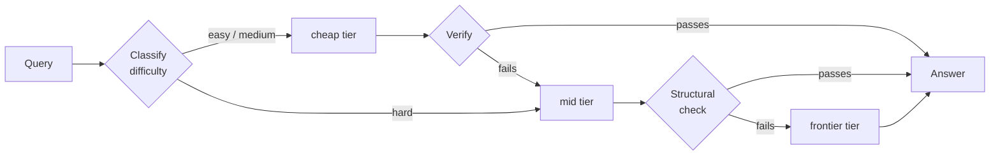
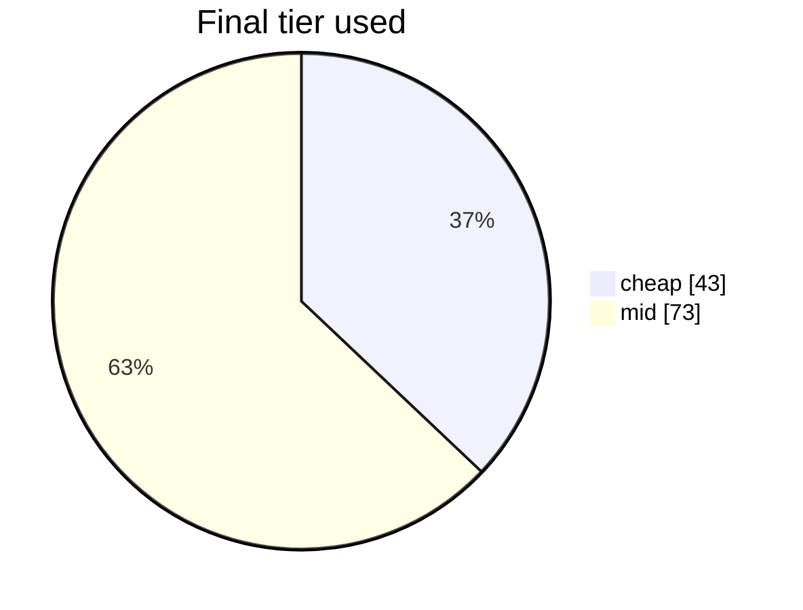

# ThriftLLM

Most LLM traffic doesn't need your most expensive model. This routes each
request to the cheapest model that can actually handle it, checks the answer,
and escalates only when the check fails.

**On a 116-query run it cost 97% less than sending everything to the
frontier model, with every graded answer correct.** It also, honestly, cost
the same as sending everything to the mid-tier model — and the reason why is
the most useful thing in this README (see
[Strategy comparison](#strategy-comparison)).


---

## Why a cascade, and not just "use the cheap model"

Because the cheap model is fine right up until it isn't. Scored across a
115-question eval set, the small local model matches the big ones on easy
questions and falls off a cliff on hard ones:


That 0.64 is the whole argument. A single-model setup makes you choose between
paying frontier prices for "what is 2+2", or shipping a 0.64 on the questions
that matter. The cascade lets each question find its own level.

The cost gap it's exploiting is large — and note the cheapest tier is also the
*slowest* here, because it runs locally on CPU:


| tier | model | quality | cost / query | latency |
|---|---|---|---|---|
| cheap | `llama3.2:3b` (Ollama, local) | 0.762 | $0.00000 | 10.2s |
| mid | `openai/gpt-oss-20b` (Groq) | 0.997 | $0.00018 | 1.2s |
| frontier | `gemini-3.5-flash-lite` (Google AI Studio) | 0.991 | $0.00085 | 2.7s |

Measured over 115 queries; automatic scoring for objective answers, LLM-judge
for the rest. Regenerate with `./venv/bin/python scripts/eval_summary.py`.

The frontier tier has since moved to `gemini-3.5-flash` (~4× the price), which
is not yet scored on this set. It replaced flash-lite because flash-lite was
*dominated* by mid — lower quality, 4.7× the cost, 2× the latency — so
escalating to it bought a worse answer for more money. A frontier tier only
earns its slot by being stronger than mid.

## The routing decision

Routing is a **similarity-weighted k-nearest-neighbour vote** over sentence
embeddings, followed by a **calibrated threshold rule**. No LLM is involved in
deciding where a prompt goes — the whole decision costs ~7ms.

```
                        ┌──────────────────────────────┐
   [ prompt ]──────────▶│  all-MiniLM-L6-v2 encoder    │
                        └──────────────┬───────────────┘
                                       │  E(q) ∈ ℝ³⁸⁴
                                       ▼
                        ┌──────────────────────────────┐
                        │  cosine vs 116 labelled qs   │
                        │  top-k = 5 neighbours        │
                        └──────────────┬───────────────┘
                                       │  weighted vote
                                       ▼
                        ┌──────────────────────────────┐
                        │  difficulty: easy/med/hard   │
                        │  + structural overrides      │
                        └──────────────┬───────────────┘
                                       │
                                       ▼
                        ┌──────────────────────────────┐
                        │  threshold rule on measured  │
                        │  quality  Q(tier,difficulty) │
                        └──────────────┬───────────────┘
                         ┌─────────────┴─────────────┐
                         ▼                           ▼
                 [ cheap tier ]                [ mid / frontier ]
                 llama3.2:3b                   gpt-oss-20b, gemini
                         │                           ▲
                         ▼                           │
                 ┌───────────────┐   fails check     │
                 │  verifier     │───────────────────┘
                 └───────┬───────┘   (escalate)
                         ▼ passes
                    [ answer ]
```

**Step 1 — difficulty by weighted similarity.** Each prompt $q$ is encoded with
`all-MiniLM-L6-v2` into $E(q) \in \mathbb{R}^{384}$ and scored against 116
labelled reference queries. The predicted difficulty is the similarity-weighted
majority over the $k$ nearest neighbours:

$$\hat{d}(q)=\arg\max_{d\,\in\,\{\text{easy},\text{med},\text{hard}\}}\ \sum_{i\,\in\,\mathcal{N}_k(q)}\cos\!\big(E(q),E(x_i)\big)\cdot\mathbb{1}[y_i=d],\qquad k=5$$

Weighting by similarity rather than counting votes matters because the
reference set is 52% `hard`: an unweighted vote inherits that skew. Structural
overrides then catch what embeddings miss — length, multi-step phrasing, and
short recall questions, which are topically similar to hard questions but are
not hard.

**Step 2 — tier by expected cost, under a quality floor.** Each tier $t$ has a
*measured* quality $Q(t,d)$ and generation cost $c(t,d)$ on difficulty band
$d$, from calibration — per band, because a mid model's easy answers cost
7× less than its overall mean. A tier may start a band only if it clears the
floor $\tau = 0.80$; among those, pick the lowest expected total cost, which
prices the whole path — generation, the judge call if this is the cheapest
tier, and the failure-weighted cost of escalating:

$$E_i(d)=c(t_i,d)+J\cdot\mathbb{1}[i=0]+\big(1-Q(t_i,d)\big)\,E_{i+1}(d),\qquad E_n(d)=c(t_n,d)$$

$$\text{tier}(d)=\arg\min_{\,i:\ Q(t_i,d)\ge\tau\ \lor\ i=n}\ E_i(d)$$

The judge term is what stops a cascade from losing to its own mid tier: on a
stack whose mid model is very cheap, the cheap tier's verdict can cost as much
as mid's own answer, and a cheaper-first rule routes into a loss. Pricing the
path makes the policy route *around* a cheap tier that can't pay for its
verification, and *to* one that can. Fed the built-in tiers' own measurements
it derives `easy→cheap, medium→cheap, hard→mid`; give it a cheap tier that
clears 0.80 on hard and it derives `hard→cheap`.

**Step 3 — verify, then escalate.** The cheapest tier's answer goes through a
learned gate before anything is paid for. The gate is a logistic regression
over signals the cheap model gives away for free — its own token logprobs
(a model that's wrong is usually less sure of it), a second sample of the
same question (wrong answers are unstable; right ones agree, especially on
the final number), and its own one-token "is this correct?" self-check with
P(YES) read off the logprobs. The scorer's $P(\text{correct})$ then decides:

| scorer says | what happens | cost |
|---|---|---|
| $P \ge 0.9$ | ship it | $0 |
| $P < 0.3$ | escalate | $0 |
| otherwise | ask the LLM judge on the tier above | one judge call |

This is FrugalGPT's idea (a learned scorer instead of an LLM judge) with one
correction from measurement: the scorer alone catches about half of the
wrong answers, the judge catches 94%, so the scorer is not allowed to
replace the judge — only to decide when the judge is needed. Measured on the
eval, it decides 37% of the time, and the answers it ships on its own were
100% correct. Later tiers get a free structural check; the last tier is never
checked.



Three things make this cheap rather than expensive:

- **Hard questions skip the cheap tier entirely.** Spending a doomed cheap call
  before escalating is worse than not trying.
- **Only the cheapest tier gets a real judge call, at low reasoning effort,
  and only when the gate can't decide.** Verification cost scales with
  response length, and later tiers rarely fail; judging every tier once cost
  82% of total spend. Then the judge itself turned out to be the cheap
  tier's entire cost — gpt-oss emits hidden reasoning tokens billed as
  output, $0.00016 per verdict against $0.00005 nominal.
  `reasoning_effort="low"` cut that 4× with identical verdicts, and the
  learned gate then removed 37% of the remaining calls.
- **The last tier is never checked.** There's nothing left to escalate to.

### How well does the routing itself do?

Classifier accuracy, leave-one-out across all 116 labelled queries — the number
that actually moved when the algorithm changed:

| classifier | exact-label accuracy | over-routed (paid too much) | under-routed (caught by verifier) |
|---|---|---|---|
| 1-nearest-neighbour | 56.0% | 21 | 23 |
| **weighted k=5 vote + overrides** | **64.7%** | **14** | **15** |

And where the traffic landed over 116 routed queries:



17 of those 116 escalated: 12 because the judge caught a real error in the
cheap answer, 5 because the gate rejected one outright without a judge call.
Everything else was answered where it started, and the 76 answers with an
objective check were all correct — including all 30 that shipped from the
cheap tier (`scripts/score_cascade_log.py`).

### Strategy comparison

The same 116 queries, priced three ways over identical token counts, so the
comparison is apples-to-apples:

| strategy | total cost | per query | vs frontier |
|---|---|---|---|
| frontier for everything (`gemini-3.5-flash`) | $0.60659 | $0.00523 | — |
| mid for everything (`gpt-oss-20b`) | $0.02045 | $0.00018 | 97% cheaper |
| **ThriftLLM cascade** | **$0.02035** | **$0.00018** | **97% cheaper** |

Read that carefully: **a single good mid-tier model also beats frontier by
97%, and the cascade ties it** — $0.02035 vs $0.02045. The question a router
has to answer is not "cheaper than the most expensive option" — it's
"cheaper than the obvious alternative", and here the honest result is a tie,
for two reasons that the numbers pin down exactly:

- **The hard questions are 80% of mid-only's spend, and the cascade sends
  them to mid too.** That is the real ceiling. Beating mid-only meaningfully
  needs a cheap tier that clears 0.80 on hard, and every candidate reachable
  from this stack was measured and fell short: `llama3:8b` scored 0.50, and
  every hosted model at list price costs more than gpt-oss-20b, which is one
  of the cheapest capable models available. There is nothing beneath it.
- **On the other 20%, escalations cost what the judge saves.** 60 queries
  started at the cheap tier; 17 escalated (28%), and an escalated question
  pays a full mid answer — the *long* ones, $0.00016 each against $0.00007
  for a typical mid answer at that difficulty. Judge on 63% of answers plus
  mid on 28% of them comes to about what mid-only pays for the same
  questions. The learned gate cut the judge calls by 37% and moved the
  total by 0.5%, which is how we know the judge was never the whole cost.
  Removing it entirely would still be a tie; the escalations are the price
  of a cheap tier that's wrong 15% of the time on medium questions.

One run earlier in this project spent $0.0176 on a single query when Groq
rate-limited mid and the cascade fell through to frontier for a 1,953-token
answer. That availability fallback is still in place — an answer instead of
an error — and it is a real cost tail: one fallback can double a run.

Because of this, routing mode is a per-chat (and per-API-request) choice:
`cascade` as described, or `direct`, which skips the cheapest tier and its
judge and starts one tier up. On the built-in stack, direct costs the same as
cascade and answers ~6× faster (0.6s vs 3.6s on the same easy question),
because it never waits on the slow local model or the verdict. Cascade is the
right default when mid is expensive or every cheap answer must be checked;
direct is the right default here.

So what the cascade buys over mid-only is not money, on this stack. It's
17 wrong cheap answers caught before they shipped — at 100% graded accuracy
on what did ship — and an answer when the mid provider is down. It *would* buy money on a stack where mid is a
typical $2–10/M model rather than one of the cheapest capable models
available; the saving is bounded by the cheap/mid price gap, and here that gap
is tiny.

Regenerate with `./venv/bin/python scripts/compare_strategies.py`.

## Bring your own models

You can run the router on your own models instead of the built-in three.
Connect a provider, list its models, calibrate them, then pick three per chat.

**Calibration is what makes routing work.** It runs ~24 objectively-scoreable
questions against your model, stratified across easy/medium/hard, and scores
each band separately. Those scores decide the routing map: each difficulty
starts at the cheapest model that scored ≥ 0.80 *on that difficulty*.

That rule isn't arbitrary — fed the built-in tiers' own measurements it
reproduces the hand-derived map above exactly. Change the models and the map
re-derives itself:

| your cheap model scores on hard | where hard questions start |
|---|---|
| 0.55 | `mid` |
| 0.88 | `cheap` |

Calibration is keyed per **model**, not per tier — measure once, then slot the
same model as cheap in one session and mid in another.

### About your provider keys

Per provider you choose:

- **Don't store it** (default) — the key lives in your browser tab for the
  session and is sent with each request. Nothing is written to disk.
- **Store it encrypted** — Fernet (AES) with a server-side `ROUTER_SECRET_KEY`.
  Without that env var set, storing is *refused* rather than silently
  downgraded to plaintext.

Either way the key is never logged, and only derived numbers (quality, cost,
latency) are persisted.

## Quickstart

```bash
python3 -m venv venv
./venv/bin/pip install -r requirements.txt
cp .env.example .env          # add GROQ_API_KEY + GEMINI_API_KEY
ollama pull llama3.2:3b       # the local cheap tier
./venv/bin/uvicorn app.main:app --port 8000
```

Then:

| what | where |
|---|---|
| Chat app (accounts, sessions, cost tracking) | http://localhost:8000/app |
| Models & calibration | http://localhost:8000/models |
| Sessions & spend | http://localhost:8000/sessions |
| API guide | http://localhost:8000/guide |
| Single-shot routing demo, no login | http://localhost:8000/demo |
| Terminal demo | `./venv/bin/python scripts/demo_cli.py` |

## Using it from code

OpenAI-compatible, with routing metadata attached:

```bash
curl -X POST http://localhost:8000/api/v1/route \
  -H "Authorization: Bearer rtr_your_key" \
  -H "Content-Type: application/json" \
  -d '{
    "messages": [{"role": "user", "content": "What is 2+2?"}],
    "models": {"cheap": "groq/openai/gpt-oss-20b", "frontier": "openai/gpt-4o"}
  }'
```

```jsonc
{
  "choices": [{ "message": { "role": "assistant", "content": "4" } }],
  "usage": { "prompt_tokens": 36, "completion_tokens": 9, "total_tokens": 45 },
  "_router": {
    "difficulty": "easy",
    "initial_tier": "cheap",
    "final_tier": "cheap",
    "escalated": false,
    "escalation_reasons": [],
    "cost": 0.0000042,
    "baseline_cost": 0.0000185,
    "latency_ms": 842.0
  }
}
```

Calibrate a model once before routing to it:

```bash
curl -X POST http://localhost:8000/api/v1/calibrate \
  -H "Authorization: Bearer rtr_your_key" \
  -d '{"model_name": "groq/openai/gpt-oss-20b", "api_key": "your-provider-key"}'
```

## Layout

```
app/
  main.py            FastAPI app - routing, auth, chat, providers, API
  classifier.py      embedding difficulty classifier (no LLM call)
  cascade.py         classify -> generate -> verify -> escalate
  verifier.py        judge call for the cheapest tier, structural check after
  scorer.py          learned gate in front of the judge (logprobs, consistency,
                     self-check); trained by scripts/train_scorer.py on data
                     from scripts/build_scorer_data.py
  routing_policy.py  turns calibration scores into a routing map
  calibration.py     measures a model across easy/medium/hard
  key_vault.py       opt-in encryption for stored provider keys
  scoring.py         exact-match / numeric / schema scorers
scripts/             eval harness, demos, chart generation
data/                116-query labelled eval set
reports/             Pareto chart, generated README charts
```

## Honest limitations

- **"Cost saved" is against frontier, and frontier is not the fair baseline.**
  Mid-only is, and the cascade ties it. The saving over frontier is real and
  large; the saving over "just use the good cheap model" is roughly zero on
  this stack. Both are stated above rather than picking the flattering one.
- **The escalation cost tail is real.** A single rate-limit fallback to
  frontier cost as much as the other 115 queries combined. Bounding it (a
  short retry on the throttled tier before escalating; a max-tokens cap on
  frontier) is a tradeoff against latency and answer completeness that this
  version hasn't made.
- **The classifier is still the weak link.** 64.7% exact-label accuracy is
  better than the 56.0% it replaced, but it's a k-NN over 116 examples, and
  embedding similarity measures *topic* rather than difficulty — "what's the
  worst case of quicksort" sits next to "explain why naive quicksort degrades
  to O(n²)" because both are about quicksort, though one is recall and the
  other is analysis. The structural overrides patch the worst of that; a
  learned difficulty model trained on the escalation log would do better.
- **The learned scorer cannot replace the judge, only gate it.** FrugalGPT
  replaces the LLM judge with a learned scorer outright. Two attempts here:
  a scorer over sentence embeddings of (query, answer) reached held-out
  ROC-AUC **0.66** — embeddings encode topic, not correctness; a right and a
  wrong explanation of TCP vs UDP have cosine similarity 0.86. Replacing
  the text features with the cheap model's own logprobs, a second sample,
  and a self-check reached **0.80** (0.85 on objectively-graded rows), from
  288 answers to 116 questions. That is enough to be sure about a third of
  answers and not enough to be the verifier: on the same answers the LLM
  judge catches 94% of wrong ones, the scorer about half. It's shipped as
  the gate described in Step 3, trained for the built-in cheap model only —
  a different model's confidence is a different distribution, so BYOM
  stacks keep the judge until `scripts/build_scorer_data.py` has been run
  against theirs.
- **The cheap tier is slow locally.** A 3B model on a laptop takes 5–15 s
  per answer, and the gate adds a parallel second sample (~25% slower) and
  a one-token self-check. A cheap answer averaged 13 s in the run above
  against 4.5 s at mid. On a hosted cheap model this is a non-issue; on
  local Ollama, `direct` mode is the faster choice.
- **Calibration samples are small.** ~8 questions per difficulty band, so the
  0.80 gate is a coarse filter, not a precise measurement.
- **Auth is project-grade, not production-grade.** bcrypt passwords and cookie
  sessions, but no rate limiting, no CSRF tokens, and cookies aren't `Secure`
  because this runs over plain localhost.

See [FAILURE_ANALYSIS.md](FAILURE_ANALYSIS.md) for cases where the verifier
caught a bad answer, missed one, and escalated when it shouldn't have.
