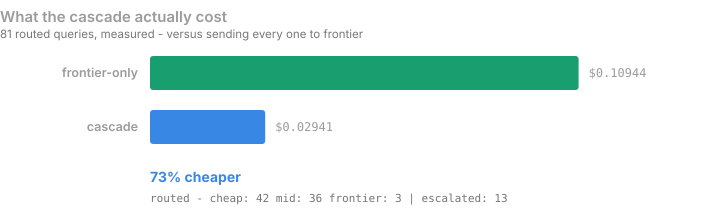
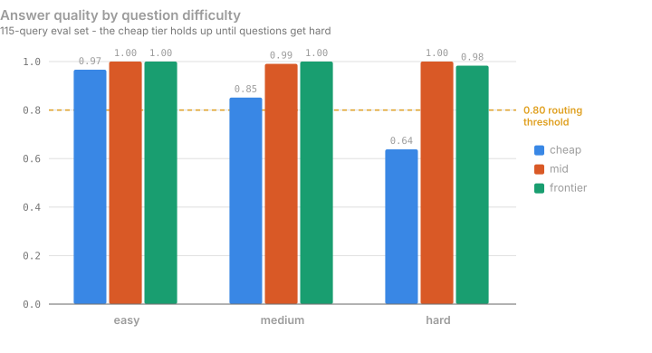
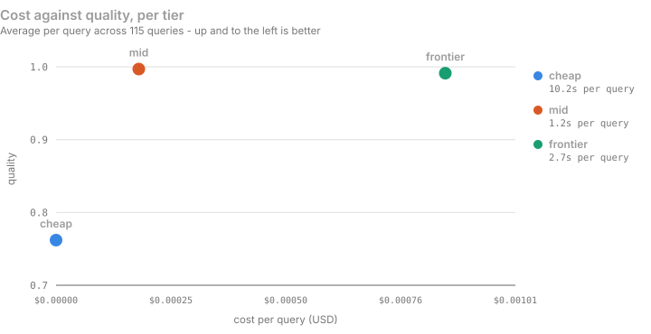
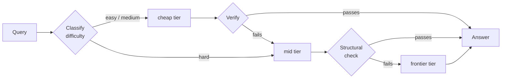
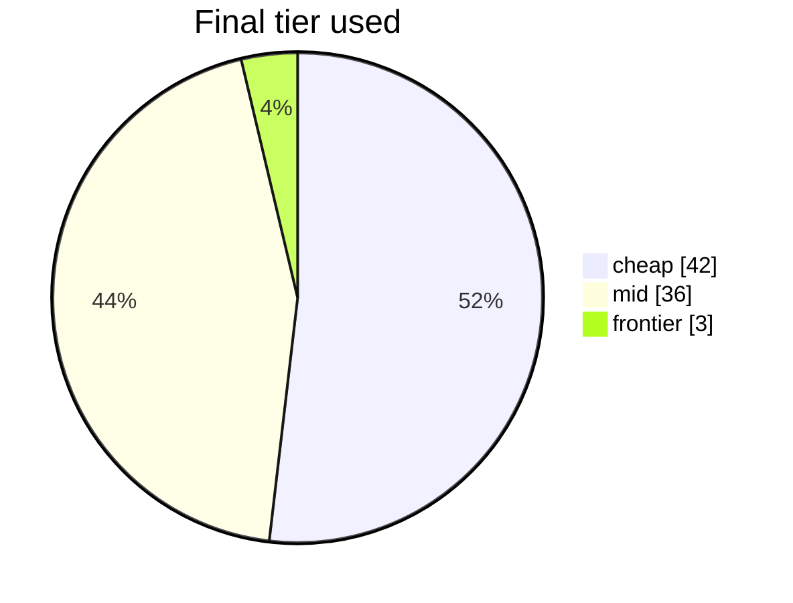

# LLM Router

Most LLM traffic doesn't need your most expensive model. This routes each
request to the cheapest model that can actually handle it, checks the answer,
and escalates only when the check fails.

**On a 81-query run, that was 73% cheaper than sending everything to the
frontier model** — at the same measured answer quality.



---

## Why a cascade, and not just "use the cheap model"

Because the cheap model is fine right up until it isn't. Scored across a
115-question eval set, the small local model matches the big ones on easy
questions and falls off a cliff on hard ones:



That 0.64 is the whole argument. A single-model setup makes you choose between
paying frontier prices for "what is 2+2", or shipping a 0.64 on the questions
that matter. The cascade lets each question find its own level.

The cost gap it's exploiting is large — and note the cheapest tier is also the
*slowest* here, because it runs locally on CPU:



| tier | model | quality | cost / query | latency |
|---|---|---|---|---|
| cheap | `llama3.2:3b` (Ollama, local) | 0.762 | $0.00000 | 10.2s |
| mid | `openai/gpt-oss-20b` (Groq) | 0.997 | $0.00018 | 1.2s |
| frontier | `gemini-3.5-flash-lite` (Google AI Studio) | 0.991 | $0.00085 | 2.7s |

Measured over 115 queries; automatic scoring for objective answers, LLM-judge
for the rest. Regenerate with `./venv/bin/python scripts/eval_summary.py`.

## How a request flows



Three things make this cheap rather than expensive:

- **Hard questions skip the cheap tier entirely.** Classification happens
  before any model call, using sentence embeddings against a labelled set — no
  LLM call, ~7ms. Spending a doomed cheap call before escalating is worse than
  not trying.
- **Only the cheapest tier gets a real judge call.** Verification cost scales
  with response length, and later tiers rarely fail. Judging every tier once
  cost 82% of total cascade spend; now later tiers get a free structural check
  (empty? refusal?) instead.
- **The last tier is never checked.** There's nothing left to escalate to.

Where the traffic actually landed over 81 routed queries:



13 of those 81 escalated. Everything else was answered where it started.

## Bring your own models

You can run the router on your own models instead of the built-in three.
Connect a provider, list its models, calibrate them, then pick three per chat.

**Calibration is what makes routing work.** It runs ~24 objectively-scoreable
questions against your model, stratified across easy/medium/hard, and scores
each band separately. Those scores decide the routing map: each difficulty
starts at the cheapest model that scored ≥ 0.80 *on that difficulty*.

That rule isn't arbitrary — fed the built-in tiers' own measurements it
reproduces the hand-derived map above exactly. Change the models and the map
re-derives itself:

| your cheap model scores on hard | where hard questions start |
|---|---|
| 0.55 | `mid` |
| 0.88 | `cheap` |

Calibration is keyed per **model**, not per tier — measure once, then slot the
same model as cheap in one session and mid in another.

### About your provider keys

Per provider you choose:

- **Don't store it** (default) — the key lives in your browser tab for the
  session and is sent with each request. Nothing is written to disk.
- **Store it encrypted** — Fernet (AES) with a server-side `ROUTER_SECRET_KEY`.
  Without that env var set, storing is *refused* rather than silently
  downgraded to plaintext.

Either way the key is never logged, and only derived numbers (quality, cost,
latency) are persisted.

## Quickstart

```bash
python3 -m venv venv
./venv/bin/pip install -r requirements.txt
cp .env.example .env          # add GROQ_API_KEY + GEMINI_API_KEY
ollama pull llama3.2:3b       # the local cheap tier
./venv/bin/uvicorn app.main:app --port 8000
```

Then:

| what | where |
|---|---|
| Chat app (accounts, sessions, cost tracking) | http://localhost:8000/app |
| Models & calibration | http://localhost:8000/models |
| Sessions & spend | http://localhost:8000/sessions |
| API guide | http://localhost:8000/guide |
| Single-shot routing demo, no login | http://localhost:8000/demo |
| Terminal demo | `./venv/bin/python scripts/demo_cli.py` |

## Using it from code

OpenAI-compatible, with routing metadata attached:

```bash
curl -X POST http://localhost:8000/api/v1/route \
  -H "Authorization: Bearer rtr_your_key" \
  -H "Content-Type: application/json" \
  -d '{
    "messages": [{"role": "user", "content": "What is 2+2?"}],
    "models": {"cheap": "groq/openai/gpt-oss-20b", "frontier": "openai/gpt-4o"}
  }'
```

```jsonc
{
  "choices": [{ "message": { "role": "assistant", "content": "4" } }],
  "usage": { "prompt_tokens": 36, "completion_tokens": 9, "total_tokens": 45 },
  "_router": {
    "difficulty": "easy",
    "initial_tier": "cheap",
    "final_tier": "cheap",
    "escalated": false,
    "escalation_reasons": [],
    "cost": 0.0000042,
    "baseline_cost": 0.0000185,
    "latency_ms": 842.0
  }
}
```

Calibrate a model once before routing to it:

```bash
curl -X POST http://localhost:8000/api/v1/calibrate \
  -H "Authorization: Bearer rtr_your_key" \
  -d '{"model_name": "groq/openai/gpt-oss-20b", "api_key": "your-provider-key"}'
```

## Layout

```
app/
  main.py            FastAPI app - routing, auth, chat, providers, API
  classifier.py      embedding difficulty classifier (no LLM call)
  cascade.py         classify -> generate -> verify -> escalate
  verifier.py        judge call for the cheapest tier, structural check after
  routing_policy.py  turns calibration scores into a routing map
  calibration.py     measures a model across easy/medium/hard
  key_vault.py       opt-in encryption for stored provider keys
  scoring.py         exact-match / numeric / schema scorers
scripts/             eval harness, demos, chart generation
data/                116-query labelled eval set
reports/             Pareto chart, generated README charts
```

## Honest limitations

- **"Cost saved" is an estimate.** It prices the tokens the cascade actually
  used against frontier's rate. Frontier tends to write longer answers, so the
  real saving is probably larger — but this number is computed, not measured
  head-to-head.
- **The classifier is the weak link.** It's 1-nearest-neighbour over 116
  labelled examples. It still mislabels some trivial arithmetic as hard, which
  costs money by starting too high.
- **Calibration samples are small.** ~8 questions per difficulty band, so the
  0.80 gate is a coarse filter, not a precise measurement.
- **Auth is project-grade, not production-grade.** bcrypt passwords and cookie
  sessions, but no rate limiting, no CSRF tokens, and cookies aren't `Secure`
  because this runs over plain localhost.

See [FAILURE_ANALYSIS.md](FAILURE_ANALYSIS.md) for cases where the verifier
caught a bad answer, missed one, and escalated when it shouldn't have.
