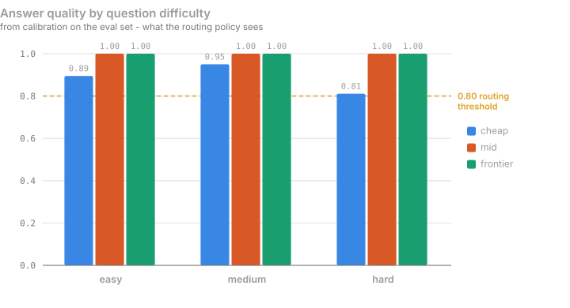
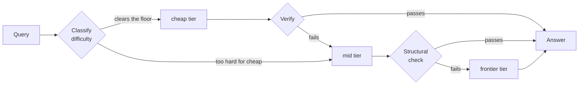
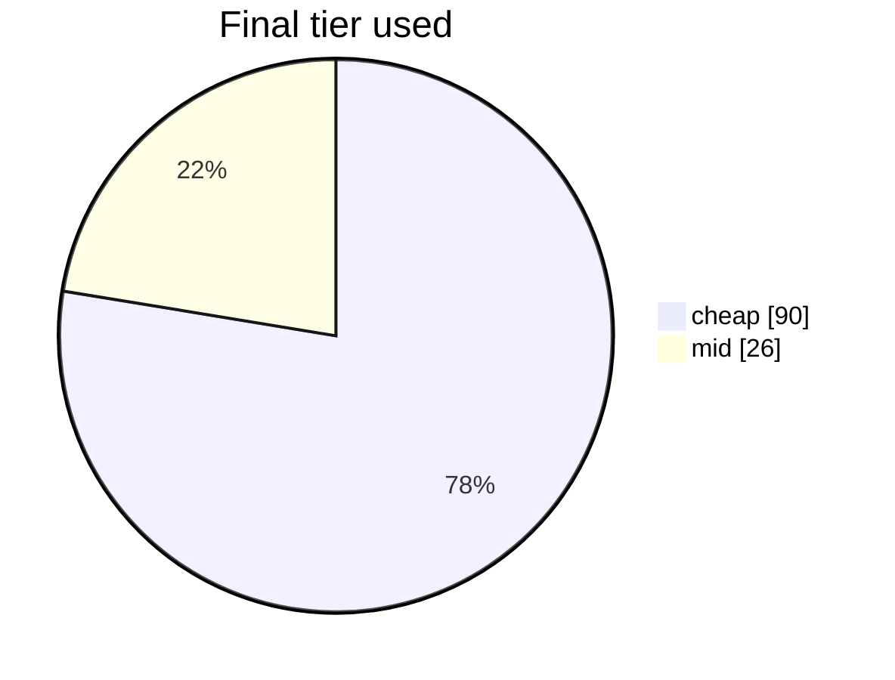

# ThriftLLM

Most LLM traffic doesn't need your most expensive model. This routes each
request to the cheapest model that can actually handle it, checks the answer,
and escalates only when the check fails.

**On a 116-query run it cost 82% less than sending everything to the
frontier model and 41–63% less than sending everything to the mid-tier
model, with every graded answer correct.** The mid-only number is the one
that matters — a single good mid model also beats frontier — and getting it
above zero took two measured attempts. The first stack tied mid-only
exactly, and the reason why is the most useful thing in this README (see
[Strategy comparison](#strategy-comparison)).


---

## Why a cascade, and not just "use the cheap model"

Because the cheap model is fine right up until it isn't. Calibrated on the
eval set, the 8B model is right about nine times in ten and wrong the tenth,
and you can't tell which from the outside:



That tenth answer is the whole argument. A single-model setup makes you
choose between paying 100× more for "what is 2+2", or shipping the wrong
answer one time in ten. The cascade lets each question find its own level,
and a verifier catches the tenth.

The cost gap it's exploiting is two orders of magnitude, and the reasoning
frontier is also the *slowest* by far, because it thinks for thousands of
tokens before answering:


| tier | model | quality | cost / answer | latency | measured on |
|---|---|---|---|---|---|
| cheap | `llama-3.1-8b-instruct` (OpenRouter) | 0.868 | $0.00002 | 6.1s | all 76 auto-gradable queries |
| judge | `gpt-oss-20b` (Groq) | catches 94% of wrong cheap answers | $0.00004 / verdict | ~1s | 117 graded answers |
| mid | `gemini-3.5-flash`, thinking off (OpenRouter) | 1.000 | $0.00192 | 2.7s | 24 queries |
| frontier | `deepseek-r1` (OpenRouter) | 1.000 | $0.00619 | 103s | 9 queries |

Quality and cost are per-band calibration numbers weighted by the eval set's
difficulty mix; cost is what the provider charged, hidden reasoning tokens
included. Regenerate with `scripts/calibrate_builtin.py`.

Two of these rows are choices worth explaining. Gemini runs with
`reasoning_effort=minimal`: at its default it spent 720 thinking tokens on a
two-sentence answer — 94% of a $0.0069 bill — and gave the same answer for
$0.0005 without. The judge is a *different, cheaper* model than mid, which
is the single decision that makes the cascade pay; see below.

## The routing decision

Routing is a **similarity-weighted k-nearest-neighbour vote** over sentence
embeddings, followed by a **calibrated threshold rule**. No LLM is involved in
deciding where a prompt goes — the whole decision costs ~7ms.

```
                        ┌──────────────────────────────┐
   [ prompt ]──────────▶│  all-MiniLM-L6-v2 encoder    │
                        └──────────────┬───────────────┘
                                       │  E(q) ∈ ℝ³⁸⁴
                                       ▼
                        ┌──────────────────────────────┐
                        │  cosine vs 116 labelled qs   │
                        │  top-k = 5 neighbours        │
                        └──────────────┬───────────────┘
                                       │  weighted vote
                                       ▼
                        ┌──────────────────────────────┐
                        │  difficulty: easy/med/hard   │
                        │  + structural overrides      │
                        └──────────────┬───────────────┘
                                       │
                                       ▼
                        ┌──────────────────────────────┐
                        │  threshold rule on measured  │
                        │  quality  Q(tier,difficulty) │
                        └──────────────┬───────────────┘
                         ┌─────────────┴─────────────┐
                         ▼                           ▼
                 [ cheap tier ]                [ mid / frontier ]
                 llama-3.1-8b                  gemini-3.5-flash, deepseek-r1
                         │                           ▲
                         ▼                           │
                 ┌───────────────┐   fails check     │
                 │  verifier     │───────────────────┘
                 └───────┬───────┘   (escalate)
                         ▼ passes
                    [ answer ]
```

**Step 1 — difficulty by weighted similarity.** Each prompt $q$ is encoded with
`all-MiniLM-L6-v2` into $E(q) \in \mathbb{R}^{384}$ and scored against 116
labelled reference queries. The predicted difficulty is the similarity-weighted
majority over the $k$ nearest neighbours:

$$\hat{d}(q)=\arg\max_{d\,\in\,\{\text{easy},\text{med},\text{hard}\}}\ \sum_{i\,\in\,\mathcal{N}_k(q)}\cos\!\big(E(q),E(x_i)\big)\cdot\mathbb{1}[y_i=d],\qquad k=5$$

Weighting by similarity rather than counting votes matters because the
reference set is 52% `hard`: an unweighted vote inherits that skew. Structural
overrides then catch what embeddings miss — length, multi-step phrasing, and
short recall questions, which are topically similar to hard questions but are
not hard.

**Step 2 — tier by expected cost, under a quality floor.** Each tier $t$ has a
*measured* quality $Q(t,d)$ and generation cost $c(t,d)$ on difficulty band
$d$, from calibration — per band, because a mid model's easy answers cost
7× less than its overall mean. A tier may start a band only if it clears the
floor $\tau = 0.80$; among those, pick the lowest expected total cost, which
prices the whole path — generation, the judge call if this is the cheapest
tier, and the failure-weighted cost of escalating:

$$E_i(d)=c(t_i,d)+J\cdot\mathbb{1}[i=0]+\big(1-Q(t_i,d)\big)\,E_{i+1}(d),\qquad E_n(d)=c(t_n,d)$$

$$\text{tier}(d)=\arg\min_{\,i:\ Q(t_i,d)\ge\tau\ \lor\ i=n}\ E_i(d)$$

The judge term is what stops a cascade from losing to its own mid tier: on a
stack whose mid model is very cheap, the cheap tier's verdict can cost as much
as mid's own answer, and a cheaper-first rule routes into a loss. Pricing the
path makes the policy route *around* a cheap tier that can't pay for its
verification, and *to* one that can. Fed the local 3B stack's measurements
it derived `easy→cheap, medium→cheap, hard→mid`; fed the current stack's,
where the 8B clears 0.80 on hard and the judge $J$ is a $0.00004 call, it
derives `hard→cheap` too — the map is an output, not a setting.

**Step 3 — verify, then escalate.** The cheapest tier's answer goes through a
learned gate before anything is paid for. The gate is a logistic regression
over signals the cheap model gives away for free — its own token logprobs
(a model that's wrong is usually less sure of it), a second sample of the
same question (wrong answers are unstable; right ones agree, especially on
the final number), and its own one-token "is this correct?" self-check with
P(YES) read off the logprobs. The scorer's $P(\text{correct})$ then decides:

| scorer says | what happens | cost |
|---|---|---|
| $P \ge 0.9$ | ship it | $0 |
| $P < 0.3$ | escalate | $0 |
| otherwise | ask the LLM judge on the tier above | one judge call |

This is FrugalGPT's idea (a learned scorer instead of an LLM judge) with one
correction from measurement: the scorer alone catches about half of the
wrong answers, the judge catches 94%, so the scorer is not allowed to
replace the judge — only to decide when the judge is needed. On the local
3B stack it decided 37% of the time at 100% accuracy on what it shipped.

Whether the gate is worth running is itself a cost question, and on the
current stack the answer is no: the gate spends a second cheap sample plus a
self-check (~$0.00003) to skip 38% of judge calls worth $0.000015, and its
held-out AUC on the 8B's answers was 0.735 — below the 0.75 bar set before
training. So the built-in stack runs **judge-only** (`VERIFIER=judge`): every
cheap answer gets a $0.00004 verdict, which is nothing next to the $0.002
mid answer it protects. The gate stays available for stacks where the judge
is the expensive part. Later tiers get a free structural check; the last
tier is never checked.



Three things make this cheap rather than expensive:

- **The judge is not the mid model.** A verdict reads ~450 tokens and writes
  one word; a small model does it as well as a big one (94% catch). Tying
  the judge to the tier above makes verification cost scale with mid's
  price, and then a cheap tier can never win — measured, on the first stack.
  `JUDGE_MODEL` breaks that link.
- **Only the cheapest tier gets a real judge call.** Verification cost scales
  with response length and later tiers rarely fail; judging every tier once
  cost 82% of total spend. Reasoning models judge at low effort — gpt-oss
  spent $0.00016 per verdict on hidden thinking against $0.00005 nominal
  until `reasoning_effort` was set.
- **The last tier is never checked.** There's nothing left to escalate to.

The cascade diagram above shows the *shape*; where each difficulty starts is
not fixed. On this stack calibration put the 8B at 0.81 on hard questions,
just over the floor, so the policy sends hard questions to it too, and the
judge catches the fifth it gets wrong. On the local 3B stack (0.73 on hard)
hard questions skipped straight to mid.

### How well does the routing itself do?

Classifier accuracy, leave-one-out across all 116 labelled queries — the number
that actually moved when the algorithm changed:

| classifier | exact-label accuracy | over-routed (paid too much) | under-routed (caught by verifier) |
|---|---|---|---|
| 1-nearest-neighbour | 56.0% | 21 | 23 |
| **weighted k=5 vote + overrides** | **64.7%** | **14** | **15** |

And where the traffic landed over 116 routed queries:



26 of those 116 escalated, every one because the judge caught a real error
in the 8B's answer — a wrong modulo, a miscounted permutation, a missed
fallacy; the verdicts read like a grader's margin notes. Everything else was
answered where it started, and the 76 answers with an objective check were
all correct, including all 58 that shipped from the cheap tier
(`scripts/score_cascade_log.py`).

### Strategy comparison

The same 116 queries, three ways. The alternatives are priced from each
model's own calibrated cost per answer on each difficulty band, times this
run's mix — not by re-pricing the cascade's tokens, which overstates a wordy
cheap model's mid-tier cost and misses a reasoning model's hidden thinking
entirely (priced that way, DeepSeek R1 came out *cheaper than Gemini*; it
isn't, by 3×). `scripts/compare_strategies.py` prints both.

| strategy | total cost | per query | graded accuracy |
|---|---|---|---|
| frontier for everything (`deepseek-r1`) | $0.735 | $0.0063 | 1.00 (calibration) |
| mid for everything (`gemini-3.5-flash`) | $0.225 – $0.360 | $0.0019 – 0.0031 | 1.00 (calibration) |
| **ThriftLLM cascade** | **$0.132** | **$0.0011** | **76/76 correct** |

The mid-only range is calibration-based at the low end and token-repriced at
the high end; the README quotes the conservative figure: **41% under
mid-only, 82% under frontier**. Where the cascade's $0.132 went: $0.006 on
90 answers from the 8B and its judge verdicts, $0.126 on the 26 that
escalated to Gemini — the hardest questions, with the longest answers.

#### Why the first stack tied, and this one doesn't

The first built-in stack was `llama3.2:3b` locally → `gpt-oss-20b` on Groq
→ `gemini-3.5-flash`, with the mid model also acting as judge. Measured the
same way it came out **$0.0204 against $0.0205 for mid-only** — a tie —
and the breakdown showed exactly why:

- 80% of the spend was hard questions, which the 3B model couldn't do
  (0.64–0.73), so they went to mid either way.
- On the other 20%, verification cost what it saved: 63% of cheap answers
  paid a judge call, 28% escalated and paid a full mid answer, and
  0.63 × judge + 0.28 × escalation came to mid's own price. With the judge
  *being* the mid model, that's a ratio — it holds at any price level, so a
  pricier mid wouldn't have fixed it.

Two changes, both cheap, turned the tie into the numbers above:

1. **A cheap tier that clears the floor on more questions.** The hosted 8B
   calibrates at 0.89 / 0.95 / 0.81, so hard questions start there too, and
   the paid model only answers the fifth it gets wrong.
2. **A judge much cheaper than a mid answer.** gpt-oss-20b verdicts cost
   $0.00004 in front of $0.002 Gemini answers. The verification overhead
   that used to equal mid's price is now 2% of it.

What the cascade doesn't buy is speed: an 8B answer via OpenRouter averaged
6.5 s in this run and an escalated question 17 s, against 2.7 s for Gemini
alone. Routing mode is a per-chat (and per-API-request) choice — `cascade`
as described, or `direct`, which skips the cheapest tier and its judge — for
exactly that reason.

The escalation cost tail is still real: one query where mid is rate-limited
falls through to the frontier, and a DeepSeek R1 answer costs 3× a Gemini
one and takes a minute or more.

Regenerate with `./venv/bin/python scripts/compare_strategies.py` and grade
with `./venv/bin/python scripts/score_cascade_log.py`.

## Bring your own models

You can run the router on your own models instead of the built-in three.
Connect a provider, list its models, calibrate them, then pick three per chat.

**Calibration is what makes routing work.** It runs ~24 objectively-scoreable
questions against your model, stratified across easy/medium/hard, and scores
each band separately. Those scores decide the routing map: each difficulty
starts at the cheapest model that scored ≥ 0.80 *on that difficulty*.

That rule isn't arbitrary — fed the built-in tiers' own measurements it
reproduces the hand-derived map above exactly. Change the models and the map
re-derives itself:

| your cheap model scores on hard | where hard questions start |
|---|---|
| 0.55 | `mid` |
| 0.88 | `cheap` |

Calibration is keyed per **model**, not per tier — measure once, then slot the
same model as cheap in one session and mid in another.

### About your provider keys

Per provider you choose:

- **Don't store it** (default) — the key lives in your browser tab for the
  session and is sent with each request. Nothing is written to disk.
- **Store it encrypted** — Fernet (AES) with a server-side `ROUTER_SECRET_KEY`.
  Without that env var set, storing is *refused* rather than silently
  downgraded to plaintext.

Either way the key is never logged, and only derived numbers (quality, cost,
latency) are persisted.

## Quickstart

```bash
python3 -m venv venv
./venv/bin/pip install -r requirements.txt
cp .env.example .env          # add OPENROUTER_API_KEY (a few $ of credit) + GROQ_API_KEY
./venv/bin/uvicorn app.main:app --port 8000
```

No GPU or local model needed: the built-in stack is entirely hosted. To run
the cheap tier locally instead, `ollama pull llama3.2:3b` and set
`CHEAP_MODEL=ollama/llama3.2:3b` — then `scripts/calibrate_builtin.py` so
the routing map is derived from *that* model's numbers.

Then:

| what | where |
|---|---|
| Chat app (accounts, sessions, cost tracking) | http://localhost:8000/app |
| Models & calibration | http://localhost:8000/models |
| Sessions & spend | http://localhost:8000/sessions |
| API guide | http://localhost:8000/guide |
| The chat app, no login, 3 prompts per device | http://localhost:8000/try |
| Single-shot routing demo, no login | http://localhost:8000/demo |
| Terminal demo | `./venv/bin/python scripts/demo_cli.py` |

## Using it from code

OpenAI-compatible, with routing metadata attached:

```bash
curl -X POST http://localhost:8000/api/v1/route \
  -H "Authorization: Bearer rtr_your_key" \
  -H "Content-Type: application/json" \
  -d '{
    "messages": [{"role": "user", "content": "What is 2+2?"}],
    "models": {"cheap": "groq/openai/gpt-oss-20b", "frontier": "openai/gpt-4o"}
  }'
```

```jsonc
{
  "choices": [{ "message": { "role": "assistant", "content": "4" } }],
  "usage": { "prompt_tokens": 36, "completion_tokens": 9, "total_tokens": 45 },
  "_router": {
    "difficulty": "easy",
    "initial_tier": "cheap",
    "final_tier": "cheap",
    "escalated": false,
    "escalation_reasons": [],
    "cost": 0.0000042,
    "baseline_cost": 0.0000185,
    "latency_ms": 842.0
  }
}
```

Calibrate a model once before routing to it:

```bash
curl -X POST http://localhost:8000/api/v1/calibrate \
  -H "Authorization: Bearer rtr_your_key" \
  -d '{"model_name": "groq/openai/gpt-oss-20b", "api_key": "your-provider-key"}'
```

## Layout

```
app/
  main.py            FastAPI app - routing, auth, chat, providers, API
  classifier.py      embedding difficulty classifier (no LLM call)
  cascade.py         classify -> generate -> verify -> escalate
  verifier.py        judge call for the cheapest tier, structural check after
  scorer.py          learned gate in front of the judge (logprobs, consistency,
                     self-check); trained by scripts/train_scorer.py on data
                     from scripts/build_scorer_data.py
  routing_policy.py  turns calibration scores into a routing map
  calibration.py     measures a model across easy/medium/hard
  key_vault.py       opt-in encryption for stored provider keys
  scoring.py         exact-match / numeric / schema scorers
scripts/             eval harness, demos, chart generation
data/                116-query labelled eval set
reports/             Pareto chart, generated README charts
```

## Honest limitations

- **The mid-only baseline is a range, not a number.** Gemini's own calibrated
  cost says $0.225 for these questions; the cascade's tokens at Gemini's
  rates say $0.360. The first is measured on 24 questions, the second prices
  another model's answer lengths. The 41% claim uses the lower one.
- **The frontier tier is measured on 9 questions.** DeepSeek R1 takes one to
  four minutes per answer and sometimes exhausts its budget while still
  thinking (3 of 12 calibration calls returned nothing; they now count as
  wrong). It's the escalation target of last resort, not a tier the policy
  routes to, so its numbers only affect the "frontier for everything" column.
- **Hard → cheap is a marginal call.** The 8B calibrated at 0.81 on hard
  against a 0.80 floor, on 37 questions; the 120-sample scorer dataset had it
  at 0.74. The judge caught every wrong hard answer in this run, but a
  weaker judge or a harder distribution would turn that margin into shipped
  errors. The floor is configurable (`QUALITY_THRESHOLD`).
- **The cheap tier is slow.** 6.5 s per answer through OpenRouter, 17 s when
  it escalates, against 2.7 s for Gemini alone. Cheaper is not faster here.
- **The classifier is still the weak link.** 64.7% exact-label accuracy is
  better than the 56.0% it replaced, but it's a k-NN over 116 examples, and
  embedding similarity measures *topic* rather than difficulty — "what's the
  worst case of quicksort" sits next to "explain why naive quicksort degrades
  to O(n²)" because both are about quicksort, though one is recall and the
  other is analysis. The structural overrides patch the worst of that; a
  learned difficulty model trained on the escalation log would do better.
- **The learned scorer cannot replace the judge, only gate it — and here it
  isn't worth gating.** FrugalGPT replaces the LLM judge with a learned
  scorer outright. Two attempts: sentence embeddings of (query, answer)
  reached held-out ROC-AUC **0.66** — embeddings encode topic, not
  correctness. The cheap model's own logprobs, a second sample and a
  self-check reached **0.80** on the 3B (0.85 on objectively-graded rows) and
  **0.735** on the 8B, which has fewer wrong answers to learn from. On the
  same answers the LLM judge catches 94% of wrong ones. The gate ships for
  stacks where the judge is the expensive call; on this one the judge costs
  2% of the answer it protects, so `VERIFIER=judge`.
- **Calibration samples are small for the paid tiers.** 8 questions per band
  for mid; the cheap tier gets all 76 because it's nearly free to measure and
  its numbers decide what never reaches a paid model.
- **Auth is project-grade, not production-grade.** bcrypt passwords and cookie
  sessions; prompts are capped per account (10/day) and per demo device (3),
  but there's no CSRF token and no rate limit on login attempts.

See [FAILURE_ANALYSIS.md](FAILURE_ANALYSIS.md) for cases where the verifier
caught a bad answer, missed one, and escalated when it shouldn't have.
