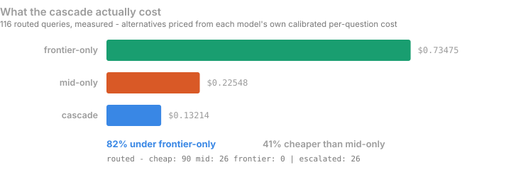
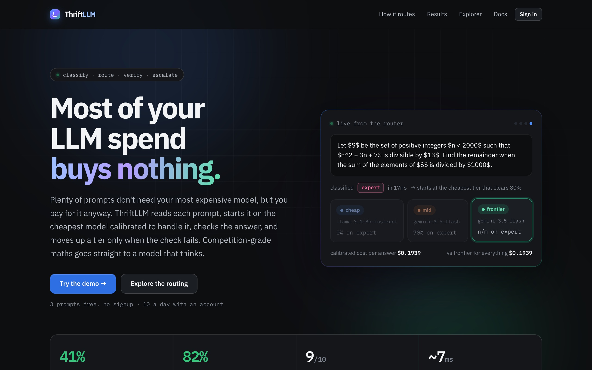
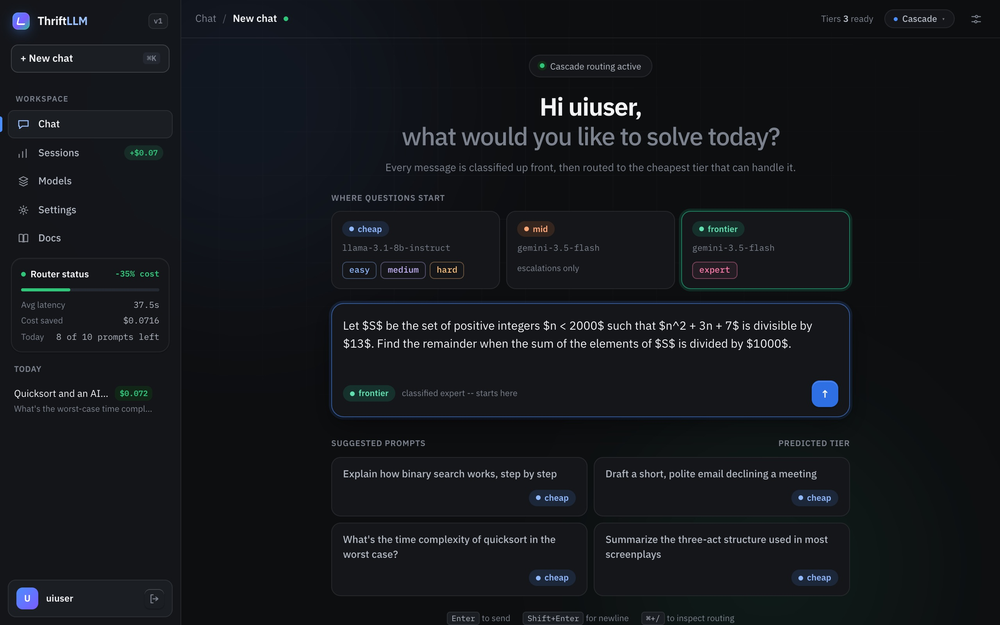
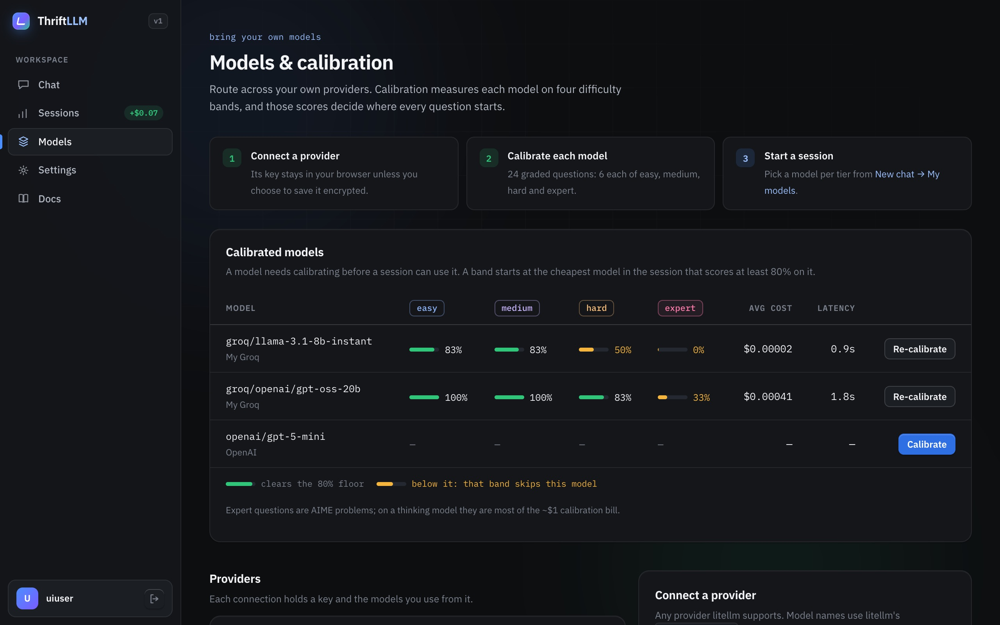
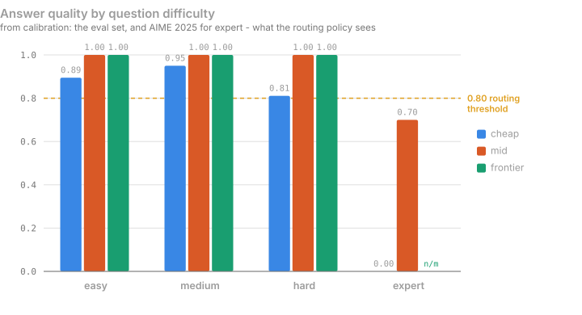
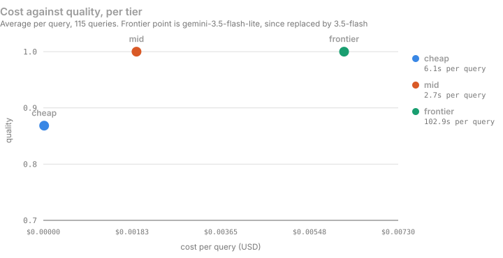
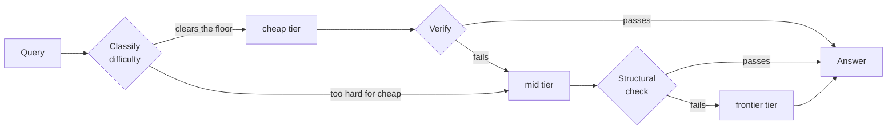
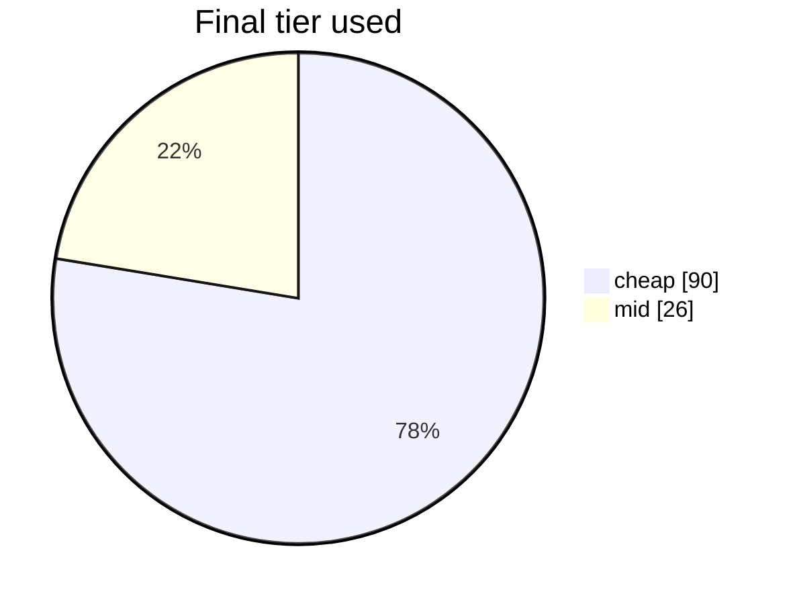

# ThriftLLM

Most LLM traffic doesn't need your most expensive model. This routes each
request to the cheapest model that can actually handle it, checks the answer,
and escalates only when the check fails.

**On a 116-query run it cost 82% less than sending everything to the
frontier model and 41–63% less than sending everything to the mid-tier
model, with every graded answer correct.** The mid-only number is the one
that matters — a single good mid model also beats frontier — and getting it
above zero took two measured attempts. The first stack tied mid-only
exactly, and the reason why is the most useful thing in this README (see
[Strategy comparison](#strategy-comparison)).





| Chat: the routing map, with the predicted tier lit as you type | Models: calibration per difficulty band, amber below the 0.80 floor |
|---|---|
|  |  |

Try `/demo` locally for the routing explorer: type any prompt and see its band, the tier
it starts at, and the calibrated numbers behind the decision, with no model call.

---

## Why a cascade, and not just "use the cheap model"

Because the cheap model is fine right up until it isn't. Calibrated on the
eval set, the 8B model is right about nine times in ten and wrong the tenth,
and you can't tell which from the outside:



That tenth answer is the whole argument. A single-model setup makes you
choose between paying 100× more for "what is 2+2", or shipping the wrong
answer one time in ten. The cascade lets each question find its own level,
and a verifier catches the tenth.

The cost gap it's exploiting is two orders of magnitude, and the reasoning
frontier is also the *slowest* by far, because it thinks for thousands of
tokens before answering:



| tier | model | quality | AIME 2025 | cost / answer | latency | measured on |
|---|---|---|---|---|---|---|
| cheap | `llama-3.1-8b-instruct` (OpenRouter) | 0.868 | 0/10 | $0.00002 | 6.1s | all 76 auto-gradable queries |
| judge | `gpt-oss-20b` (Groq) | catches 94% of wrong cheap answers | — | $0.00004 / verdict | ~1s | 117 graded answers |
| mid | `gemini-3.5-flash`, thinking **off** | 1.000 | 7/10 | $0.00192 | 3.3s | 24 queries + 10 AIME |
| frontier | `gemini-3.5-flash`, thinking **on** | 1.000 | 2 of mid's 3 misses | $0.00700 | 5.3s | 24 queries + 3 AIME |

Quality and cost are per-band calibration numbers weighted by the eval set's
difficulty mix; cost is what the provider charged, hidden reasoning tokens
included. Regenerate with `./venv/bin/python -m scripts.calibration.calibrate_builtin`.
The AIME column is the expert band, below.

Three of these rows are choices worth explaining.

**Mid and frontier are the same model**, separated only by whether it is
allowed to think. That is not a shortcut — it is what the measurements
picked. Mid runs `reasoning_effort=minimal`: at its default it spent 720
thinking tokens on a two-sentence answer, 94% of a $0.0069 bill, and gave
the same answer for $0.0005 without. The frontier is the same model with
thinking on, which on hard questions is worth real accuracy (below).

**The judge is a different, cheaper model than mid** — the single decision
that makes the cascade pay; see below.

The 1.000 quality scores are a limitation of the everyday eval set, not a
claim that these tiers are equivalent. Competition maths is where they part:
mid gets 7 of 10 AIME 2025 problems, and the router now starts those at the
frontier; see "Does the frontier tier earn its slot?".

## The routing decision

Routing is a **similarity-weighted k-nearest-neighbour vote** over sentence
embeddings, followed by a **calibrated threshold rule**. No LLM is involved in
deciding where a prompt goes — the whole decision costs ~7ms.

```
                        ┌──────────────────────────────┐
   [ prompt ]──────────▶│  all-MiniLM-L6-v2 encoder    │
                        └──────────────┬───────────────┘
                                       │  E(q) ∈ ℝ³⁸⁴
                                       ▼
                        ┌──────────────────────────────┐
                        │  cosine vs 116 labelled qs   │
                        │  top-k = 5 neighbours        │
                        └──────────────┬───────────────┘
                                       │  weighted vote
                                       ▼
                        ┌──────────────────────────────┐
                        │  difficulty: easy/med/hard   │
                        │  + structural overrides      │
                        └──────────────┬───────────────┘
                                       │
                                       ▼
                        ┌──────────────────────────────┐
                        │  threshold rule on measured  │
                        │  quality  Q(tier,difficulty) │
                        └──────────────┬───────────────┘
                         ┌─────────────┴─────────────┐
                         ▼                           ▼
                 [ cheap tier ]                [ mid / frontier ]
                 llama-3.1-8b                  gemini-3.5-flash, thinking off / on
                         │                           ▲
                         ▼                           │
                 ┌───────────────┐   fails check     │
                 │  verifier     │───────────────────┘
                 └───────┬───────┘   (escalate)
                         ▼ passes
                    [ answer ]
```

**Step 1 — difficulty by weighted similarity.** Each prompt $q$ is encoded with
`all-MiniLM-L6-v2` into $E(q) \in \mathbb{R}^{384}$ and scored against 176
labelled reference queries: 116 everyday ones (easy / medium / hard) and 60
AIME problems (expert). An **expert gate** goes first: if at least half the
similarity weight among the 7 nearest neighbours is expert, the prompt is
expert. Otherwise the difficulty is the similarity-weighted majority over the
$k$ nearest *everyday* neighbours:

$$\hat{d}(q)=\arg\max_{d\,\in\,\{\text{easy},\text{med},\text{hard}\}}\ \sum_{i\,\in\,\mathcal{N}_k(q)}\cos\!\big(E(q),E(x_i)\big)\cdot\mathbb{1}[y_i=d],\qquad k=5$$

Weighting by similarity rather than counting votes matters because the
reference set is 52% `hard`: an unweighted vote inherits that skew. Structural
overrides then catch what embeddings miss — length, multi-step phrasing, and
short recall questions, which are topically similar to hard questions but are
not hard.

**Step 2 — tier by expected cost, under a quality floor.** Each tier $t$ has a
*measured* quality $Q(t,d)$ and generation cost $c(t,d)$ on difficulty band
$d$, from calibration — per band, because a mid model's easy answers cost
7× less than its overall mean. A tier may start a band only if it clears the
floor $\tau = 0.80$; among those, pick the lowest expected total cost, which
prices the whole path — generation, the judge call if this is the cheapest
tier, and the failure-weighted cost of escalating:

$$E_i(d)=c(t_i,d)+J\cdot\mathbb{1}[i=0]+\big(1-Q(t_i,d)\big)\,E_{i+1}(d),\qquad E_n(d)=c(t_n,d)$$

$$\text{tier}(d)=\arg\min_{\,i:\ Q(t_i,d)\ge\tau\ \lor\ i=n}\ E_i(d)$$

The judge term is what stops a cascade from losing to its own mid tier: on a
stack whose mid model is very cheap, the cheap tier's verdict can cost as much
as mid's own answer, and a cheaper-first rule routes into a loss. Pricing the
path makes the policy route *around* a cheap tier that can't pay for its
verification, and *to* one that can. Fed the local 3B stack's measurements
it derived `easy→cheap, medium→cheap, hard→mid`; fed the current stack's,
where the 8B clears 0.80 on hard and the judge $J$ is a $0.00004 call, it
derives `hard→cheap` too, and `expert→frontier`, because mid scores 0.70 on
competition maths. The map is an output, not a setting.

**Step 3 — verify, then escalate.** The cheapest tier's answer goes through a
learned gate before anything is paid for. The gate is a logistic regression
over signals the cheap model gives away for free — its own token logprobs
(a model that's wrong is usually less sure of it), a second sample of the
same question (wrong answers are unstable; right ones agree, especially on
the final number), and its own one-token "is this correct?" self-check with
P(YES) read off the logprobs. The scorer's $P(\text{correct})$ then decides:

| scorer says | what happens | cost |
|---|---|---|
| $P \ge 0.95$ | ship it, no judge call | $0 |
| otherwise | ask the LLM judge | ~$0.00004 |

The shipped scorer uses only the **free** signals — logprobs, entropy,
length, difficulty — so stage 1 adds no API call at all. A stronger variant
that also samples a second answer and asks the model to self-check is one
env var away (`SCORER_FEATURES=everything`, then retrain); it discriminates
better (AUC 0.735 vs 0.656) but costs two extra cheap calls, which only pays
on a stack where a judge verdict is expensive relative to an answer.

This is FrugalGPT's idea (a learned scorer instead of an LLM judge) with one
correction from measurement: the scorer alone catches about half of the
wrong answers, the judge catches 94%, so the scorer is not allowed to
replace the judge — only to decide when the judge is needed. On the local
3B stack it decided 37% of the time at 100% accuracy on what it shipped.

Both thresholds are measured, and they are deliberately lopsided because
the two mistakes are not symmetric. **Accept at 0.95** is the highest band
where *zero* wrong answers slipped through held-out testing (0 of 15); at
0.90, two would have. **Reject ships disabled** (threshold 0.0): in the
low-confidence band most answers the scorer doubts turn out to be correct —
at P < 0.05, half of them — so escalating on the scorer's word alone buys a
needless paid answer. The judge is better at that call, so it gets to make it.

How much the gate is worth depends entirely on what a verdict costs relative
to the answer it protects. On this stack a $0.00004 judge guards a $0.002
answer, so verification is 2% of the bill and the gate trims ~5% of that —
real, but small. Point the judge at the tier above instead, as the first
stack did, and a verdict costs about what the next answer would; there the
same code is the difference between a cascade that pays for itself and one
that ties its own mid tier. Later tiers get a free structural check; the last
tier is never checked.


```mermaid
flowchart LR
    Q[Query] --> C{Classify<br/>difficulty}
    C -->|clears the floor| CH[cheap tier]
    C -->|too hard for cheap| MID[mid tier]
    CH --> V{Verify}
    V -->|passes| OUT[Answer]
    V -->|fails| MID
    MID --> V2{Structural<br/>check}
    V2 -->|passes| OUT
    V2 -->|fails| FR[frontier tier]
    FR --> OUT
```

Three things make this cheap rather than expensive:

- **The judge is not the mid model.** A verdict reads ~450 tokens and writes
  one word; a small model does it as well as a big one (94% catch). Tying
  the judge to the tier above makes verification cost scale with mid's
  price, and then a cheap tier can never win — measured, on the first stack.
  `JUDGE_MODEL` breaks that link.
- **Only the cheapest tier gets a real judge call.** Verification cost scales
  with response length and later tiers rarely fail; judging every tier once
  cost 82% of total spend. Reasoning models judge at low effort — gpt-oss
  spent $0.00016 per verdict on hidden thinking against $0.00005 nominal
  until `reasoning_effort` was set.
- **The last tier is never checked.** There's nothing left to escalate to.

The cascade diagram above shows the *shape*; where each difficulty starts is
not fixed. On this stack calibration put the 8B at 0.81 on hard questions,
just over the floor, so the policy sends hard questions to it too, and the
judge catches the fifth it gets wrong. On the local 3B stack (0.73 on hard)
hard questions skipped straight to mid.

### How well does the routing itself do?

Classifier accuracy, leave-one-out across the 116 everyday labelled queries —
the number that actually moved when the algorithm changed:

| classifier | exact-label accuracy | over-routed (paid too much) | under-routed (caught by verifier) |
|---|---|---|---|
| 1-nearest-neighbour + overrides | 55.2% | 22 | 30 |
| weighted k=5 vote + overrides | 64.7% | 24 | 17 |
| **expert gate, then the k=5 vote** | **62.1%** | **27** | **17** |

All three rows are counted the same way: the predicted label against the
true one, with today's structural overrides. Earlier versions of this table
mixed counting methods.

The last row is the price of the expert band: four everyday maths questions
("smallest $n$ with $n!$ divisible by 1000", the interior angles of a
heptagon) now look enough like competition problems to start at the
frontier, which answers them correctly at a higher price. The gate catches
54 of the 60 AIME problems. A single four-band vote did worse on both counts
(10 false experts, 53 caught); `./venv/bin/python -m scripts.classifier.evaluate_loo`
prints the full confusion matrix.

And where the traffic landed over 116 routed queries:


```mermaid
pie showData
    title Final tier used
    "cheap" : 90
    "mid" : 26
```

26 of those 116 escalated, every one because the judge caught a real error
in the 8B's answer — a wrong modulo, a miscounted permutation, a missed
fallacy; the verdicts read like a grader's margin notes. Everything else was
answered where it started, and the 76 answers with an objective check were
all correct, including all 58 that shipped from the cheap tier
(`scripts/eval/score_cascade_log.py`). This run predates the expert band.

### Does the frontier tier earn its slot?

On everyday questions, no. On competition maths, yes, and the router now
routes by that difference instead of never reaching the frontier at all.

**Everyday questions can't see a difference.** Both paid tiers score 1.000 on
the 116-question eval set. Its "hard" band was labelled against a 3B local
model, so it contains things like "write a palindrome check". In a full
116-query run the frontier tier was **never reached even once**.

**Benchmarks built to be hard barely see it.**
`scripts/probe/build_bbh_math.py` draws from MATH-500 level 5 and 14
BIG-Bench Hard task families, all with ground-truth answers:

| 263 questions | accuracy | cost / question |
|---|---|---|
| mid alone (thinking off) | 252/263 = **95.8%** | $0.0038 |
| + thinking frontier on the 11 it failed | 254/263 = **96.6%** | $0.0047 |

**+0.8 points for +23% cost.** Earlier versions of this README said 288
questions. The probe had run twice, and 25 BBH questions were counted in both
runs. One of those, a `dyck_languages` question, failed in one run and passed
in the other. So its "rescue" below is partly a coin toss.

| task | rescued |
|---|---|
| BBH `dyck_languages` | 1/1 |
| MATH-500 level 5 | 1/4 |
| BBH `geometric_shapes` | **0/6** |

`geometric_shapes` asks a model to read an SVG path and name the figure.
That is a perception limit, not a reasoning-budget one, and thinking time
doesn't fix it.

**Mid reasons in the open.** Turning thinking off doesn't stop a model
reasoning. It stops it reasoning *privately*: mid writes its working into
the answer, which is exactly what BBH rewards. So the next attempt targeted
*search*, where a model has to try a branch, find it fails and back up.
`scripts/probe/build_expert_set.py` generates puzzles and brute-forces each
one to a unique answer:

| generated family | mid, thinking off |
|---|---|
| Countdown: hit a 3-digit target with 6 numbers, needing at least 5 of them | 6/6 |
| knights and knaves, 7–8 islanders | 6/6 |
| 4×4 logic grid, every redundant clue removed | 6/6 |
| shortest path where the greedy route is a trap | 6/6 |
| lattice paths around blocked points | 1/1 |

**25/25**, at $0.014 a puzzle. Mid searches in the open too, in about 1,000
visible tokens per puzzle.

**Competition maths separates them.** AIME 2025, the first ten problems of a
seeded shuffle (`data/eval/expert_queries.json`):

| tier | AIME 2025 | cost / problem | time |
|---|---|---|---|
| cheap (8B) | 0/10 | $0.0002 | 92 s |
| mid (thinking off) | **7/10** | $0.019 | 14 s |
| frontier (thinking on), on mid's 3 misses | **2/3** | $0.19 | 119 s |

Mid's three misses are real wrong answers: 88 instead of 81, 73 instead of
60, and one cut off by its 4,096-token cap partway through the arithmetic.
The frontier spent 13–17k reasoning tokens getting two of those right. The
third ran into its own 32k cap while still thinking. Mid with the frontier
behind it gets **9/10**.

**What the router does with it.** These problems are a fourth difficulty
band, `expert`. Calibration puts mid at 0.70 there, under the 0.80 floor, so
the policy derives `expert → frontier`. It is the first time anything starts
at the frontier on measured evidence:

| band | cheap | mid | frontier | starts at |
|---|---|---|---|---|
| easy | 0.89 | 1.00 | 1.00 | cheap |
| medium | 0.95 | 1.00 | 1.00 | cheap |
| hard | 0.81 | 1.00 | 1.00 | cheap |
| expert | 0.00 | **0.70** | rescues 2/3 | **frontier** |

On paper, starting expert questions at mid and escalating would be cheaper:
$0.077 expected against $0.19. That arithmetic assumes mid's failures get
caught, but mid's answers only get the free structural check, which cannot
tell 88 from 81. The floor stops the policy shipping that 30%.

**How far to trust it.** Ten problems is a small sample: 7/10 has a 95%
interval of roughly 0.40–0.89, so mid being below the floor is likely rather
than certain. The frontier's own accuracy on the band is unmeasured, because
it only ran on mid's misses. As the last tier its score never gates routing,
so the calibration file leaves it blank rather than quoting 2/3. The run
stopped at ten because a frontier AIME answer costs $0.13–0.29 and the
account balance was low. To extend it (about $0.02 per problem for mid,
$0.20 for the frontier; `--budget` is a hard stop):

```bash
./venv/bin/python -m scripts.probe.run_probe --models mid --per-family 30 --budget 1
./venv/bin/python -m scripts.probe.run_probe --models frontier --per-family 30 --budget 6
./venv/bin/python -m scripts.calibration.calibrate_builtin --expert-only
```

`deepseek-r1` held the frontier slot before this and lost the comparison
outright: it rescued none of the failures tested, cost 3x, and averaged
**467s** per answer, which no interactive request can absorb.

**Four grading bugs found while measuring this**, each of which made a
model look worse than it was, and all four caught only by reading the
answers rather than trusting the score:

| the grader wanted | the model said | verdict |
|---|---|---|
| `syndrome therefrom` | `syndrome, therefrom` | scored 0/5 on a task it got 5/5 right |
| `(B)` | `(B) heptagon` | scored 2/17 on a task it got 11/17 right |
| `hypertext transfer protocol` | `**H**yper**T**ext **T**ransfer **P**rotocol` | marked wrong for its bold |
| a Countdown expression | `(25 * 7) + 75 + 2 + 1` | scored 0/6 on a task it got 6/6 right: stripping `*` as markdown deleted the multiplication |

Fixing the second alone moved mid from 83.2% to 97.5% on the BBH set, and
retired a "frontier rescued this" result that was really mid having been
marked wrong. An automatic grader measures formatting as readily as
correctness; treat any accuracy number here as a lower bound.

### Strategy comparison

The same 116 queries, three ways. The alternatives are priced from each
model's own calibrated cost per answer on each difficulty band, times this
run's mix — not by re-pricing the cascade's tokens, which overstates a wordy
cheap model's mid-tier cost and misses a reasoning model's hidden thinking
entirely (priced that way, DeepSeek R1 came out *cheaper than Gemini*; it
isn't, by 3×). `scripts/eval/compare_strategies.py` prints both.

| strategy | total cost | per query | graded accuracy |
|---|---|---|---|
| frontier for everything (`deepseek-r1`) | $0.735 | $0.0063 | 1.00 (calibration) |
| mid for everything (`gemini-3.5-flash`) | $0.225 – $0.360 | $0.0019 – 0.0031 | 1.00 (calibration) |
| **ThriftLLM cascade** | **$0.132** | **$0.0011** | **76/76 correct** |

The mid-only range is calibration-based at the low end and token-repriced at
the high end; the README quotes the conservative figure: **41% under
mid-only, 82% under frontier**. Where the cascade's $0.132 went: $0.006 on
90 answers from the 8B and its judge verdicts, $0.126 on the 26 that
escalated to Gemini — the hardest questions, with the longest answers.

#### Why the first stack tied, and this one doesn't

The first built-in stack was `llama3.2:3b` locally → `gpt-oss-20b` on Groq
→ `gemini-3.5-flash`, with the mid model also acting as judge. Measured the
same way it came out **$0.0204 against $0.0205 for mid-only** — a tie —
and the breakdown showed exactly why:

- 80% of the spend was hard questions, which the 3B model couldn't do
  (0.64–0.73), so they went to mid either way.
- On the other 20%, verification cost what it saved: 63% of cheap answers
  paid a judge call, 28% escalated and paid a full mid answer, and
  0.63 × judge + 0.28 × escalation came to mid's own price. With the judge
  *being* the mid model, that's a ratio — it holds at any price level, so a
  pricier mid wouldn't have fixed it.

Two changes, both cheap, turned the tie into the numbers above:

1. **A cheap tier that clears the floor on more questions.** The hosted 8B
   calibrates at 0.89 / 0.95 / 0.81, so hard questions start there too, and
   the paid model only answers the fifth it gets wrong.
2. **A judge much cheaper than a mid answer.** gpt-oss-20b verdicts cost
   $0.00004 in front of $0.002 Gemini answers. The verification overhead
   that used to equal mid's price is now 2% of it.

What the cascade doesn't buy is speed: an 8B answer via OpenRouter averaged
6.5 s in this run and an escalated question 17 s, against 2.7 s for Gemini
alone. Routing mode is a per-chat (and per-API-request) choice — `cascade`
as described, or `direct`, which skips the cheapest tier and its judge — for
exactly that reason.

The escalation cost tail is still real: one query where mid is rate-limited
falls through to the frontier, and a DeepSeek R1 answer costs 3× a Gemini
one and takes a minute or more.

Regenerate with `./venv/bin/python -m scripts.eval.compare_strategies` and grade
with `./venv/bin/python -m scripts.eval.score_cascade_log`.

## Bring your own models

You can run the router on your own models instead of the built-in three.
Connect a provider, list its models, calibrate them, then pick three per chat.

**Calibration is what makes routing work.** It runs 24 objectively-scoreable
questions against your model, six from each of easy, medium, hard and expert,
and scores each band separately. Those scores decide the routing map: each
difficulty starts at the cheapest model that scored ≥ 0.80 *on that
difficulty*. The six expert questions are AIME problems. On a thinking model
they are most of the calibration bill: about $1 on a frontier-class model,
against cents for everything else. A calibration made before the expert band
existed has no expert score, so those questions start at the strongest model
in the session until you re-calibrate.

That rule isn't arbitrary — fed the built-in tiers' own measurements it
reproduces the hand-derived map above exactly. Change the models and the map
re-derives itself:

| your cheap model scores on hard | where hard questions start |
|---|---|
| 0.55 | `mid` |
| 0.88 | `cheap` |

Calibration is keyed per **model**, not per tier — measure once, then slot the
same model as cheap in one session and mid in another.

### About your provider keys

Per provider you choose:

- **Don't store it** (default) — the key lives in your browser tab for the
  session and is sent with each request. Nothing is written to disk.
- **Store it encrypted** — Fernet (AES) with a server-side `ROUTER_SECRET_KEY`.
  Without that env var set, storing is *refused* rather than silently
  downgraded to plaintext.

Either way the key is never logged, and only derived numbers (quality, cost,
latency) are persisted.

## Quickstart

```bash
python3 -m venv venv
./venv/bin/pip install -r requirements.txt
cp .env.example .env          # add OPENROUTER_API_KEY (a few $ of credit) + GROQ_API_KEY
./venv/bin/uvicorn app.main:app --port 8000
```

No GPU or local model needed: the built-in stack is entirely hosted. To run
the cheap tier locally instead, `ollama pull llama3.2:3b` and set
`CHEAP_MODEL=ollama/llama3.2:3b` — then
`./venv/bin/python -m scripts.calibration.calibrate_builtin` so the routing
map is derived from *that* model's numbers.

Then:

| what | where |
|---|---|
| Chat app (accounts, sessions, cost tracking) | http://localhost:8000/app |
| Models & calibration | http://localhost:8000/models |
| Sessions & spend | http://localhost:8000/sessions |
| API guide | http://localhost:8000/guide |
| The chat app, no login, 3 prompts per device | http://localhost:8000/try |
| Routing explorer: where a prompt would go and why, no model call | http://localhost:8000/demo |
| Terminal demo | `./venv/bin/python -m scripts.ops.demo_cli` |

## Using it from code

### Python SDK

```python
import os
import thriftllm

thriftllm.configure(api_key="rtr_...", base_url="http://localhost:8000")

small = thriftllm.calibrate("groq/openai/gpt-oss-20b", api_key=os.environ["GROQ_API_KEY"])
large = thriftllm.calibrate("openai/gpt-5", api_key=os.environ["OPENAI_API_KEY"])

router = thriftllm.Router(cheap=small, frontier=large)
reply = router.chat("What is the capital of Australia?")
print(reply.text, reply.tier, reply.cost)
print(reply.explain())
```

`calibrate()` connects the model if needed and runs 24 graded questions on
your key (six per band, expert included). A model calibrated before comes back
straight away with its stored numbers. The router sends your provider keys
with each request; the server uses them for that call and never stores them.
`pip install -e sdk/python`; the full reference is in
[`sdk/python/README.md`](sdk/python/README.md).

### HTTP

OpenAI-compatible, with routing metadata attached:

```bash
curl -X POST http://localhost:8000/api/v1/route \
  -H "Authorization: Bearer rtr_your_key" \
  -H "Content-Type: application/json" \
  -d '{
    "messages": [{"role": "user", "content": "What is 2+2?"}],
    "models": {"cheap": "groq/openai/gpt-oss-20b", "frontier": "openai/gpt-4o"}
  }'
```

```jsonc
{
  "choices": [{ "message": { "role": "assistant", "content": "4" } }],
  "usage": { "prompt_tokens": 36, "completion_tokens": 9, "total_tokens": 45 },
  "_router": {
    "difficulty": "easy",
    "initial_tier": "cheap",
    "final_tier": "cheap",
    "escalated": false,
    "escalation_reasons": [],
    "cost": 0.0000042,
    "baseline_cost": 0.0000185,
    "trace": {
      "classification": {"band": "easy", "ms": 7.1, "neighbours": [{"band": "easy", "similarity": 0.81, "text": "What is 17 * 23?"}, "..."]},
      "start": {"chosen": "cheap", "floor": 0.8, "tiers": [{"tier": "cheap", "quality": 0.9, "clears_floor": true, "expected_cost": 0.00003}, "..."]},
      "attempts": [{"tier": "cheap", "cost": 0.0000042, "outcome": "shipped", "check": {"kind": "judge", "judge_verdict": "YES"}}],
      "totals": {"cost": 0.0000042, "baseline": 0.0000185, "saved": 0.0000143}
    },
    "latency_ms": 842.0
  }
}
```

`trace` is the same record the chat app renders under **Why this route?**.

The built-in routing map is public, with the calibration behind it:

```bash
curl http://localhost:8000/api/routing
# {"map": {"easy": "cheap", "medium": "cheap", "hard": "cheap", "expert": "frontier"},
#  "quality": {"mid": {"expert": 0.7, ...}, ...}, "threshold": 0.8, ...}
```

Calibrate a model once before routing to it. It is connected automatically
if it isn't yet; the provider comes from the `groq/` prefix:

```bash
curl -X POST http://localhost:8000/api/v1/calibrate \
  -H "Authorization: Bearer rtr_your_key" \
  -d '{"model_name": "groq/openai/gpt-oss-20b", "api_key": "your-provider-key"}'
```

| endpoint | what it does | costs |
|---|---|---|
| `POST /api/v1/calibrate` | connect and calibrate a model | 24 answers on your key |
| `GET /api/v1/models` | your calibrated models and their per-band scores | free |
| `POST /api/v1/routing-map` | which tier each band starts at for a set of models | free |
| `POST /api/v1/classify` | where a prompt would start, and why | free, no model call |
| `POST /api/v1/route` | answer through the cascade; `_router.trace` holds the full route | the answer |

## Layout

```
app/
  main.py              FastAPI app: mounts the routers, loads the classifier in the background
  config.py            the three tiers and the judge, from env vars
  paths.py             every data file the code reads or writes
  pricing.py           cost estimates and the "what frontier would have cost" baseline
  auth.py              passwords, sessions, API keys
  api/                 HTTP routers: pages, account, chats, demo, v1, models, usage
  routing/
    classifier.py      embedding difficulty classifier (no LLM call)
    policy.py          turns calibration scores into a routing map
    cascade.py         classify -> generate -> verify -> escalate
    verifier.py        judge call for the cheapest tier, structural check after
    scorer.py          learned gate in front of the judge
  evaluation/
    datasets.py        the labelled question sets and difficulty bands
    graders.py         every automatic grader, shared by evals, probes and calibration
    calibration.py     measures a model across all four bands
  storage/             SQLite / Turso connection, accounts and chats, eval log, key vault
  web/                 HTML templates and static assets
scripts/               run as modules, e.g. ./venv/bin/python -m scripts.probe.run_probe
  eval/                the 116-query eval harness, strategy comparison, README charts
  probe/               build and run the tier-separating question sets
  calibration/         calibrate the built-in stack
  classifier/          leave-one-out accuracy, active-learning candidates
  scorer/              build data for and train the learned gate
  ops/                 Turso migration, terminal demo
data/
  eval/                eval_queries.json (116 everyday), expert_queries.json (60 AIME), judge scores
  probe/               probe question sets and every answer from every run (.jsonl)
  calibration/         builtin.json: measured quality and cost per tier and band
  scorer/              the trained gate (+ its training data, gitignored)
sdk/python/            the thriftllm client: calibrate(), Router(), reply.explain()
tests/                 graders, policy, classifier rules, the HTTP layer and the SDK, with models stubbed
docs/                  handbook, internals reference, failure analysis, deploy guide, roadmap
```

Run the tests with `./venv/bin/python -m pytest`. They never call a model,
and they refuse to run against Turso even when `.env` configures it.

Two scripts check a running server for real:

```bash
# every feature over HTTP (plus Chrome with --browser); costs a fraction of a cent
./venv/bin/python -m scripts.ops.e2e_check --base-url http://localhost:8000 --browser

# the Python SDK with your app's API key and real provider keys
THRIFTLLM_API_KEY=rtr_... GROQ_API_KEY=... ./venv/bin/python -m scripts.ops.sdk_check --base-url http://localhost:8000
```

## Handbook

[`docs/handbook.md`](docs/handbook.md) walks through the whole application:
every page and feature, how each is built and where its code lives, the
routing engine, the data model, every setting, and how to test all of it
(unit tests, the end-to-end and SDK checks, and a manual checklist).

## Full internals document

[`docs/internals.html`](docs/internals.html) is the complete reference: every
mechanism, the measurement behind each decision, and the approaches that were
tried and abandoned. Twenty sections covering the classifier's weighted k=5
vote and its structural overrides, the expected-cost policy with a worked
example, two-stage verification and why both thresholds are lopsided,
calibration's stratify-then-interleave design, the data model's 17 tables, the
HTTP surface, Turso's embedded replica, cold starts, and a file-by-file map.

Open it locally (`open docs/internals.html`) or read the sections it draws
from below.

## Honest limitations

- **The mid-only baseline is a range, not a number.** Gemini's own calibrated
  cost says $0.225 for these questions; the cascade's tokens at Gemini's
  rates say $0.360. The first is measured on 24 questions, the second prices
  another model's answer lengths. The 41% claim uses the lower one.
- **The expert band rests on ten AIME problems.** Mid's 0.70 there has a
  wide interval (roughly 0.40–0.89), and the frontier's own accuracy on the
  band is unmeasured. It only ran on the three problems mid missed, at
  $0.13–0.29 each. The commands to extend it are under "Does the frontier
  tier earn its slot?". Until then, `expert → frontier` is a likely call
  rather than a settled one.
- **Expert questions the classifier misses get mid-quality answers.** Six of
  the 60 AIME problems classify as hard, start at the cheap tier, and end at
  mid once the judge rejects the 8B's attempt. Mid's answer only gets the
  structural check, so a wrong one ships. A frontier-strength check on mid's
  answers would close that gap, at a frontier price.
- **The "frontier for everything" column predates the current frontier.** It
  was measured with DeepSeek R1, which takes one to four minutes per answer
  and sometimes exhausts its budget while still thinking.
- **Hard → cheap is a marginal call.** The 8B calibrated at 0.81 on hard
  against a 0.80 floor, on 37 questions; the 120-sample scorer dataset had it
  at 0.74. The judge caught every wrong hard answer in this run, but a
  weaker judge or a harder distribution would turn that margin into shipped
  errors. The floor is configurable (`QUALITY_THRESHOLD`).
- **The cheap tier is slow.** 6.5 s per answer through OpenRouter, 17 s when
  it escalates, against 2.7 s for Gemini alone. Cheaper is not faster here.
- **The classifier is still the weak link.** 62.1% exact-label accuracy on
  the everyday set (64.7% before the expert gate took four of its maths
  questions) is better than the 56.0% it replaced, but it's a k-NN over 176
  examples, and
  embedding similarity measures *topic* rather than difficulty — "what's the
  worst case of quicksort" sits next to "explain why naive quicksort degrades
  to O(n²)" because both are about quicksort, though one is recall and the
  other is analysis. The structural overrides patch the worst of that; a
  learned difficulty model trained on the escalation log would do better.
- **The learned scorer cannot replace the judge, only gate it.** FrugalGPT replaces the LLM judge with a learned
  scorer outright. Two attempts: sentence embeddings of (query, answer)
  reached held-out ROC-AUC **0.66** — embeddings encode topic, not
  correctness. The cheap model's own logprobs, a second sample and a
  self-check reached **0.80** on the 3B (0.85 on objectively-graded rows) and
  **0.735** on the 8B, which has fewer wrong answers to learn from. On the
  same answers the LLM judge catches 94% of wrong ones — so the scorer gates
  the judge and never replaces it. What ships is the free-signal variant at a
  conservative threshold: it skips ~5% of judge calls having shipped no wrong
  answer in testing. On this stack that is a couple of percent of a bill that
  is already 98% generation; its value is much larger on a stack where the
  judge is the expensive call, which is the configuration it was built for.
- **Calibration samples are small for the paid tiers.** 6–8 questions per
  band for mid; the cheap tier gets all 76 because it's nearly free to measure
  and its numbers decide what never reaches a paid model.
- **Auth is project-grade, not production-grade.** bcrypt passwords and cookie
  sessions; usage is capped per account (10 prompts and 50,000 built-in-model
  tokens a day) and for the demo (3 prompts a device, 6 a network, 150,000
  tokens a day in total), but there's no CSRF token and no rate limit on login
  attempts.

See [docs/FAILURE_ANALYSIS.md](docs/FAILURE_ANALYSIS.md) for cases where the verifier
caught a bad answer, missed one, and escalated when it shouldn't have.
