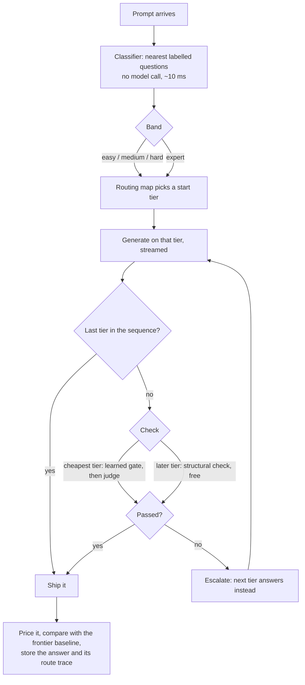

# ThriftLLM handbook

What every part of the app does, how it is built, and how to test it.

For the measurements behind each design decision, see
[`internals.html`](internals.html). For deployment, see
[`deploy-oracle.md`](deploy-oracle.md). This handbook answers three questions:
what is there, where is the code, and how do I check that it works.

**Contents**

1. [The idea in one minute](#1-the-idea-in-one-minute)
2. [What happens to one prompt](#2-what-happens-to-one-prompt)
3. [The pages](#3-the-pages)
4. [Features and how each is built](#4-features-and-how-each-is-built)
5. [The routing engine](#5-the-routing-engine)
6. [Data and storage](#6-data-and-storage)
7. [Configuration](#7-configuration)
8. [Testing](#8-testing)
9. [Where to change things](#9-where-to-change-things)
10. [Known gaps](#10-known-gaps)

---

## 1. The idea in one minute

Most questions don't need an expensive model. ThriftLLM keeps three
**tiers** of model and sends each prompt to the cheapest one that is likely
to answer it well:

| tier | built-in model | what it's for |
|---|---|---|
| cheap | Llama 3.1 8B (OpenRouter) | everyday questions; its answers are checked before they ship |
| mid | Gemini 3.5 Flash, thinking **off** | what the cheap tier gets wrong |
| frontier | Gemini 3.5 Flash, thinking **on** | competition-level maths, where thinking changes the answer |

A **judge** (gpt-oss-20b on Groq, about $0.00004 per verdict) checks the
cheap tier's answers. When it rejects one, the prompt **escalates** to the
next tier.

Where a prompt starts is not hard-coded. Every tier is **calibrated**: graded
on questions with known answers in four **difficulty bands** (easy, medium,
hard, expert). A tier may start a band only if it scores at least 80% there.
Among the tiers that clear that floor, the router picks the one with the
lowest *expected* cost, counting the check and the chance of escalating. On
the built-in stack that gives:

```
easy -> cheap    medium -> cheap    hard -> cheap    expert -> frontier
```

Users can also bring their own models (BYOM). They connect a provider,
calibrate its models, and the same policy derives a routing map from their
models' scores.

## 2. What happens to one prompt



1. **Classify** ([`app/routing/classifier.py`](../app/routing/classifier.py)).
   The prompt is embedded with MiniLM and compared with 176 labelled
   questions. A similarity-weighted vote picks the band. This takes
   milliseconds and calls no model.
2. **Pick the start** ([`app/routing/policy.py`](../app/routing/policy.py)).
   The band is looked up in the routing map derived from calibration.
3. **Generate** ([`app/routing/cascade.py`](../app/routing/cascade.py)). The
   start tier answers, streamed token by token to the browser.
4. **Check** ([`app/routing/verifier.py`](../app/routing/verifier.py),
   [`app/routing/scorer.py`](../app/routing/scorer.py)). The cheapest
   configured tier gets a real check: the learned gate, then the judge if
   the gate isn't sure. Later tiers get a free structural check (not empty,
   not a refusal). The last tier is never checked, because nothing is left
   to escalate to.
5. **Escalate** if the check fails. The browser is told to discard what it
   showed, and the next tier's answer streams in its place.
6. **Record**. The cost is priced from the provider's usage block (hidden
   reasoning tokens included) and compared with what the frontier would have
   cost. The answer is stored with a full **route trace**: the neighbours,
   the vote, each tier's score against the floor, every attempt and what
   checked it, and the totals. "Why this route?" shows this trace.

## 3. The pages

| URL | who | what |
|---|---|---|
| `/` | signed out | Landing page. Signed-in users are redirected to `/app` |
| `/try` | anyone | The real chat app in demo mode: 3 prompts per device, nothing saved |
| `/demo` | anyone | Routing explorer: type a prompt and see its band and start tier. No model is called |
| `/app` | signed in | The chat app (it also shows the sign-in screen) |
| `/models` | signed in | Connect providers, add models, calibrate them |
| `/sessions` | signed in | Every chat and API key with its spend and savings |
| `/settings` | signed in | API keys, the daily allowance, a sample request |
| `/guide` | anyone | API documentation: quickstart, SDK, tiers, verification, calibration |
| `/health` | anyone | JSON: database kind, durability, whether the router is ready |
| `/api/status` | anyone | JSON: classifier loading state (supports a long poll) |

Every page is a static HTML file in
[`app/web/templates/`](../app/web/templates/) with its own inline script, served by
[`app/api/pages.py`](../app/api/pages.py). There is no build step and no
frontend framework. Shared pieces live in
[`app/web/static/`](../app/web/static/):

| file | role |
|---|---|
| `app.css` | design tokens (colours, type, radii) for light and dark, and shared components |
| `theme.js` | applies the saved theme before first paint; turns `[data-theme-toggle]` buttons into toggles |
| `warmup.js` | the "Starting the router" notice; exposes `window.routerReady` and `onRouterReady()` |
| `nav.js` | the signed-in sidebar: links, user row, theme toggle, logout |
| `reveal.js` | scroll-in animation on the landing page |

`/try` is the same file as `/app`. `pages.py` injects
`window.THRIFT_DEMO = true`, and the chat page then sends to `/api/try`
instead of a saved chat.

## 4. Features and how each is built

Each feature below lists what it does, how it works, and where the code is.

### 4.1 Landing page (`/`)

**What.** It explains the cascade using live data. It has:
- the routing map as a matrix of bands × tiers with calibrated scores;
- an animated walk-through of example prompts showing which lane each takes;
- a card contrasting mid (no thinking) with frontier (thinking);
- calls to action: "Try the full application" (`/try`), "Explore the
  routing" (`/demo`) and sign up.

**How.** [`landing.html`](../app/web/templates/landing.html) fetches the
public `GET /api/routing`. That returns `builtin_routing()` from
[`app/api/common.py`](../app/api/common.py): the models, the map, the per-band
quality and cost, and the 0.80 threshold. Nothing on the page is hard-coded,
so recalibrating changes what it shows. The live panel waits for
`onRouterReady` before classifying anything.

### 4.2 Free demo (`/try`)

**What.** The full chat UI with no account, capped at **3 prompts per
device**. The answer and its route trace are shown, but nothing is saved.

**How.** `POST /api/try` in [`app/api/demo.py`](../app/api/demo.py) streams
the cascade as server-sent events, the same way the real chat does. The
browser sends the last 6 turns as history, because the server stores none.

**The limits, and why there are three.** No website can read a MAC address,
and none reaches the server across the internet, so a device can't be
pinned down for certain. Three layers bound the cost instead:

| limit | default | how it's tracked | what resets it |
|---|---|---|---|
| per device | 3 prompts | a random id in an httponly cookie (`tl_demo`), mirrored in localStorage and sent as `X-Demo-Device`. Clearing one leaves the other | clearing all site data |
| per network | 6 prompts/day | a salted SHA-256 of the IP (the raw IP is never stored), in `daily_usage` | the next UTC day |
| everyone together | 150,000 tokens/day | the subject `demo-all` in `daily_usage` | the next UTC day |

The global token budget caps the bill no matter what anyone does: about
$1.40 a day even if every token were frontier thinking. Behind Caddy,
uvicorn runs with `--proxy-headers`, so it sees the visitor's real IP, not
the proxy's.

### 4.3 Routing explorer (`/demo`)

**What.** Type or pick a prompt and see its band, its start tier, each
tier's score on that band against the floor, and a sentence explaining the
choice. It's free and unlimited because no model is called.

**How.** [`demo.html`](../app/web/templates/demo.html) debounces input and
calls `POST /api/try/classify`. That endpoint runs the classifier with the
built-in routing map. Prompts typed while the router is still loading are
queued and classified once it's ready.

### 4.4 Accounts and sign-in

**What.** Username and password sign-up and login, 30-day sessions, logout.

**How.** [`app/auth.py`](../app/auth.py) and
[`app/api/account.py`](../app/api/account.py):
- **Passwords** are hashed with bcrypt.
- **Sessions:** a session is a random token (`secrets.token_urlsafe(32)`) in
  the `sessions` table, sent as an httponly cookie named `router_session`.
  The cookie gets the `Secure` flag when `COOKIE_SECURE=1`, which
  docker-compose sets because Caddy terminates TLS.
- **Access control:** every signed-in endpoint depends on
  `get_current_user`, which checks the cookie, its expiry and the user.
- **Rules:** usernames need 3+ characters, passwords 6+.

### 4.5 The chat app (`/app`)

[`chat_app.html`](../app/web/templates/chat_app.html) is the largest file in
the frontend. It contains the following features.

**Streaming answers with live escalation.**
- **Sending:** `POST /api/chats/{id}/messages/stream` returns server-sent
  events (`routing`, `tier_start`, `token`, `escalated`, `done`, `error`).
  `routing` arrives first, so the answer's tier badge appears before any
  text.
- **Escalation:** if the check fails, `escalated` tells the page to clear the
  streamed text and show which tier takes over.
- **Saving:** `done` carries the final text, cost, saving and trace. The
  server saves the turn in `_finish_send` in
  [`app/api/chats.py`](../app/api/chats.py).

**Predicted route while typing.** As you type, the composer shows the band
and start tier the prompt would get. This is `POST /api/classify` with the
chat's id, so a BYOM chat shows *its* routing map, not the built-in one. No
model is called.

**"Why this route?"** Every answer has a button that opens its stored trace
in four steps:
1. **Classified:** the five nearest labelled questions with their
   similarity bars, the vote totals, the expert gate's share, and any
   override rule that fired.
2. **Started at:** each tier's model, its calibrated score on this band
   against the 80% floor, and the expected cost of starting there.
3. **What happened:** each attempt with its model, cost, time and tokens,
   and what checked it: the gate's P(correct) against its threshold, the
   judge's verdict, or the structural check.
4. **Cost:** spent, what the strongest tier would have cost, and the saving.

The trace is built in `cascade._plan` (classification and sequence), filled
in during the run (attempts), and completed by `finish_trace` in
`common.py` (start explanation and totals). It is stored as JSON in
`chat_messages.route_trace`.

**Maths rendering.** Answers are markdown (marked + DOMPurify) with LaTeX
typeset by KaTeX. `$…$`, `$$…$$`, `\(…\)` and `\[…\]` all work.
- **Order of operations:** maths is lifted out *before* markdown runs, or
  marked would turn `a_1` into italics. Code spans and fences are matched
  first and left alone, so `$PATH` in a shell snippet stays code.
- **Where else it renders:** your own messages and the example questions in
  the trace typeset maths too.
- **Sidebar preview:** it can't typeset, so it shows a plain reading
  ("n² + 3n + 7").
- **Code:** code blocks are highlighted with highlight.js.

**Routing mode.** The pill in the header switches the chat between:
- **Cascade** (default): the full cheap → check → escalate behaviour.
- **Direct**: starts one tier above the cheapest and skips its judge. It's
  faster, and costs the same when mid is already cheap.

This is `plan_sequence(..., skip_cheapest=True)` in `cascade.py`, stored per
chat as `routing_mode`.

**Chat management.** New chat (⌘K), rename, pin and delete from each
sidebar item's menu. Chats list newest first with pinned ones on top, and
each shows its first message and money saved.

**Status card.** In the sidebar:
- average latency and money saved across your chats;
- prompts and tokens left today, from `GET /api/chat-stats`;
- in demo mode, the demo prompts left instead.

**BYOM chats.** "New chat" offers the built-in models or a session on your
own calibrated models.
- **Choosing models:** you pick a model per tier. A model must be
  calibrated before it can be used (`validate_byom_models`).
- **Keys:** if a provider's key isn't saved, the chat shows a banner asking
  for it. The key stays in the browser tab and goes with each request.

### 4.6 Router startup notice

**What.** Pages load at once. A notice in the top-right says "Starting the
router", with a timer, while the classifier loads. When it's ready, it
changes to "Router ready". Until then, sending is disabled and prediction
badges wait.

**How.** Importing torch and loading MiniLM takes about 14 seconds on a
laptop and a minute or more on a shared vCPU, so it no longer blocks
startup.
- **Background load:** `on_startup` in [`app/main.py`](../app/main.py)
  starts `classifier.warm()` in a background thread.
- **Long poll:** `GET /api/status?wait=20` holds the request until the
  model is ready or 20 seconds pass. On a scale-to-zero host, an open
  request also keeps the CPU allocated, so the load doesn't crawl.
- **In the page:** [`warmup.js`](../app/web/static/warmup.js) polls in a
  loop, then sets `window.routerReady`, runs queued `onRouterReady`
  callbacks and dispatches a `router-ready` event.

The app now imports in about 2.3 seconds, down from 8.7.

### 4.7 Light and dark theme

**What.** Light by default. A sun/moon toggle on every page switches to dark
and remembers the choice in that browser.

**How.**
- **Tokens:** [`app.css`](../app/web/static/app.css) defines every colour as
  a CSS variable. The bare `:root` holds the dark palette, and
  `:root[data-theme="light"]` redefines the same tokens for light.
- **Before first paint:** [`theme.js`](../app/web/static/theme.js) loads in
  `<head>` and sets `data-theme` (light unless `localStorage.tl_theme` is
  `"dark"`), so there is no flash of the wrong theme.
- **Toggle buttons:** any element with `data-theme-toggle` becomes a toggle.
- **Rule for new code:** components never use literal colours, only tokens,
  so a new component works in both themes.

### 4.8 Daily limits for accounts

**What.** Each account gets **10 prompts** and **50,000 tokens** per UTC
day:
- The **prompt cap** covers everything: chat, the OpenAI-compatible
  endpoint and the BYOM route API.
- The **token cap** covers the built-in models only. BYOM runs on the
  user's own keys.
- Reaching either returns HTTP 429 with a message saying when it resets.

**How.** `enforce_daily_limit` in [`app/api/common.py`](../app/api/common.py).
- **Prompts** are counted from stored chat messages and the usage log.
- **Tokens** are counted by `tokens_used(result)`, which sums input and
  output of *every attempt*. An escalation counts both answers, and hidden
  reasoning counts because providers bill it as output.
- **Storage:** tokens go into `daily_usage` under `user:{id}`.

A token cap is needed because one competition-maths answer can make the
frontier think for 30,000 tokens (about $0.29).

### 4.9 Bring your own models (`/models`)

**What.**
1. **Connect a provider:** Groq, Gemini, OpenAI, Anthropic, Mistral,
   DeepSeek, Together, OpenRouter, Ollama or a custom `api_base`.
2. **Add model names** in litellm's `provider/model` form.
3. **Calibrate** each model.
4. **Start a chat** with calibrated models in any tier slots. The routing
   map for that chat comes from those models' scores.

**How.** [`app/api/models.py`](../app/api/models.py) and
[`app/evaluation/calibration.py`](../app/evaluation/calibration.py).

- **Calibration** sends 24 questions with known answers, 6 per band
  (expert is AIME), using the user's key, and grades them automatically
  ([`graders.py`](../app/evaluation/graders.py)). It stores only derived
  numbers per band: quality, cost and latency.
- **Question order:** questions are interleaved across bands, so a rate
  limit partway through loses a little of every band instead of all of
  one.
- **Reuse:** results are stored per *model*, not per slot, so the same
  measurement works whether the model is cheap in one chat and mid in
  another.
- **Provider keys** are not stored by default. They live in the browser tab
  and go with each request. A user can choose to save a key per provider;
  it is then encrypted with Fernet, using a key derived from
  `ROUTER_SECRET_KEY` ([`key_vault.py`](../app/storage/key_vault.py)).
  Without that secret, saving is refused rather than stored in plain text.
- **Judge:** BYOM chats use the user's own next tier up as the judge.

### 4.10 API keys, sessions and spend (`/settings`, `/sessions`)

**What.**
- **Settings:**
  - Create and revoke API keys (`rtr_…`). A key is shown once.
  - See today's prompt and token allowance.
  - Copy a sample request.
- **Sessions:**
  - Lists chats and API keys together, with call counts, cost and saving.
  - Opening an API session shows its individual calls.
  - "New API session" just creates a key.

**How.** [`app/api/account.py`](../app/api/account.py) issues keys. Only a
SHA-256 of the key is stored. A fast hash is right here: the key is 43
random characters, not a guessable password.
[`app/api/usage.py`](../app/api/usage.py) reads `usage_log` and the chat
tables.

### 4.11 HTTP API

All of it is in [`app/api/v1.py`](../app/api/v1.py), authenticated with
`Authorization: Bearer rtr_…`.

| endpoint | what it does | counts toward limits |
|---|---|---|
| `POST /v1/chat/completions` | OpenAI-compatible, on the built-in stack. The response has the usual shape plus `_router` (band, tiers, escalation, cost, baseline, trace) | prompts + tokens |
| `POST /api/v1/calibrate` | connect (if needed) and calibrate a model with a provider key; the key isn't stored | no |
| `GET /api/v1/models` | every model this account has calibrated, with per-band numbers | no |
| `POST /api/v1/routing-map` | the band → tier map for a set of calibrated models | no |
| `POST /api/v1/classify` | where a prompt would start and why, with no model call | no |
| `POST /api/v1/route` | the cascade across your own calibrated models | prompts |

`/v1/chat/completions` refuses to run without a key unless `ALLOW_ANON_V1=1`
is set. Only the local eval harness sets that.

### 4.12 Python SDK (`sdk/python`)

**What.** A small client over the API:

```python
import thriftllm
thriftllm.configure(api_key="rtr_...", base_url="https://your-host")
small  = thriftllm.calibrate("groq/openai/gpt-oss-20b",  api_key=GROQ_KEY)
medium = thriftllm.calibrate("groq/openai/gpt-oss-120b", api_key=GROQ_KEY)
router = thriftllm.Router(cheap=small, mid=medium)
reply  = router.chat("What is the capital of Australia?")
print(reply.text, reply.tier, reply.cost)
print(reply.explain())          # the same route "Why this route?" shows
```

**How.** [`sdk/python/thriftllm/client.py`](../sdk/python/thriftllm/client.py)
uses httpx and calls the endpoints above:
- `calibrate()` reuses a stored calibration unless you pass `force=True`.
- `Router.route_map` and `Router.classify()` call the server, so the SDK
  never re-implements the policy.
- Server errors raise `ThriftLLMError`, with the HTTP status and the
  server's explanation.

### 4.13 Health and readiness

`GET /health` reports:
- the database backend (`sqlite` or `turso`, never the URL);
- whether data is durable (`false` means a serverless host with no Turso, so
  accounts would vanish on restart);
- whether the router is ready;
- any configuration warnings.

docker-compose uses `/health` as its healthcheck.

## 5. The routing engine

### 5.1 Classifier

[`app/routing/classifier.py`](../app/routing/classifier.py). The reference
set is the 116 everyday questions in `data/eval/eval_queries.json` (easy 20,
medium 36, hard 60) plus the 60 AIME problems in `expert_queries.json`. All
176 are embedded once at startup. For a new prompt the classifier works in
three steps:

1. **Expert gate.** Take the 7 nearest examples. If at least 50% of their
   total similarity is expert, the band is expert.
2. **Everyday vote.** Otherwise, take the 5 nearest *non-expert* examples.
   Each votes for its band, weighted by its similarity.
3. **Overrides** (`override()`), for what topic similarity can't see:
   - longer than 25 words, or asking for several steps: at least medium;
   - mentions code: easy becomes medium;
   - a short "what/which/how…" recall question that voted hard is capped
     at medium.

Measured leave-one-out:
- **Expert:** recall 54/60; 4 of the 116 everyday questions are wrongly
  sent to expert.
- **Everyday bands:** 62% exact. Misses are cheap because verification
  catches under-routing.

### 5.2 Policy

[`app/routing/policy.py`](../app/routing/policy.py). For each band:

1. **Quality floor.** Only tiers scoring at least 0.80 on the band may
   start it. The strongest configured tier is always allowed, because
   something has to start.
2. **Expected cost** among those, solved from the last tier backwards:
   ```
   E[start at tier] = its generation cost
                    + its judge cost (cheapest tier only)
                    + P(fail) × E[start at the next tier]
   ```
3. **Pick the lowest.** Ties go to the stronger tier.

This rule is what keeps the cascade from losing money to its own mid tier.
When the judge's call costs about what mid's answer does, starting cheap
can't pay for itself, and the policy routes around the cheap tier. A band
with no measurement (for example expert, on an old calibration) starts at
the strongest tier.

### 5.3 Cascade and verification

[`app/routing/cascade.py`](../app/routing/cascade.py) has a blocking form
(`run_cascade`, used by the API) and a streaming form
(`run_cascade_stream`, used by the chat and demo). Both work the same way:

- **Who gets checked.** Only the cheapest *configured* tier gets a paid
  check, and only when a tier above exists. Checking mid's long answers
  with a judge was once 82.5% of total cascade cost for little benefit.
- **Learned gate first** ([`scorer.py`](../app/routing/scorer.py)). It
  reads the cheap model's own token log-probabilities and predicts
  P(correct):
  - At or above 0.95 the answer ships with no judge call. The threshold is
    the highest at which no wrong answer slipped through in held-out data.
  - Below 0.95 the judge decides.
  - It only runs on the built-in stack with logprobs available. On the
    current stack about 95% of answers still go to the judge, so the gate
    saves little. It matters more when the judge is expensive.
- **Judge** ([`verifier.py`](../app/routing/verifier.py)). It is asked
  "does this answer address every part and is it free of obvious errors?
  YES or NO: reason", with low reasoning effort.
  - An empty verdict counts as a failure, so it escalates.
  - A rate-limited judge counts as a pass, because an unavailable judge
    isn't evidence the answer is wrong.
- **Structural check** for later tiers: not empty and not a refusal. It
  costs nothing.
- **Unavailable tiers.** A rate limit, auth error or connection error skips
  the tier instead of failing the request. Only if every tier fails does
  the user see "all tiers busy".

### 5.4 Pricing and savings

[`app/pricing.py`](../app/pricing.py):
- **What an answer cost:** priced from the provider's usage block, so a
  thinking model's hidden reasoning is counted. Streams ask for it with
  `stream_options.include_usage`. Without it, cost is estimated from the
  text length, and the trace marks it `priced_from: estimate`.
- **The baseline** ("what the frontier would have cost"): the frontier's
  calibrated cost for that band. Per-token pricing can't be used, because
  mid and frontier are the same model at the same list price; they differ
  only in thinking tokens.
- **BYOM baseline:** the user's own strongest model, priced at its rates.

### 5.5 Calibration of the built-in stack

`python -m scripts.calibration.calibrate_builtin` writes
`data/calibration/builtin.json`.
- **easy/medium/hard:** cheap is measured on all 76 automatically gradable
  everyday questions; mid and frontier on 24.
- **expert:** taken from the AIME probe
  (`data/probe/expert_queries_results.jsonl`). Mid scores 0.70 there.
- **Frontier's expert score** is left unmeasured: it was only run on mid's
  misses, and as the last tier it never gates routing.
- **Model check:** [`app/config.py`](../app/config.py) only trusts the file
  when its model names match the configured stack. Otherwise it falls back
  to defaults written in the code.

## 6. Data and storage

### 6.1 Files under `data/`

| path | what |
|---|---|
| `eval/eval_queries.json` | 116 labelled everyday questions. These are the classifier's references and the calibration questions |
| `eval/expert_queries.json` | 60 AIME 2024–25 problems, the expert band |
| `eval/judge_scores.json` | manual grades for open-ended answers |
| `calibration/builtin.json` | measured quality and cost per tier and band |
| `probe/*` | question sets that separate tiers, and every answer from every run |
| `scorer/answer_scorer.joblib` | the trained learned gate |

### 6.2 Database

One SQLite schema. Locally it's a file (`logs/router.db`, or
`ROUTER_DB_PATH`); in production it's **Turso**, which is SQLite over the
network. The app connects as an *embedded replica*: reads are local
(~0.05 ms), writes go to Turso, and a wiped container re-syncs on boot.
See [`app/storage/connection.py`](../app/storage/connection.py).

| table | holds |
|---|---|
| `users`, `sessions` | accounts and login sessions |
| `chats`, `chat_messages` | conversations; assistant turns carry tier, cost, baseline, band and `route_trace` |
| `chat_models` | which model fills each tier in a BYOM chat |
| `api_keys` | hashed `rtr_` keys |
| `providers`, `provider_models` | BYOM connections (with an optional encrypted key) and their models |
| `model_calibrations` | per-model, per-band quality and cost |
| `usage_log` | every API call, for Sessions and the prompt count |
| `daily_usage` | prompts and tokens per subject per UTC day (`user:7`, `demo-ip:…`, `demo-all`) |
| `demo_usage` | prompt count per demo device |
| `model_configs`, `calibration_results` | older per-tier tables kept for existing rows |
| `requests`, `eval_responses`, `eval_scores`, `cascade_log` | the eval harness's log ([`eval_log.py`](../app/storage/eval_log.py)) |

New columns are added by small migrations in `init_chat_db()`, so an
existing database upgrades in place on boot.

> **Your `.env` points at the production Turso database.** Anything run
> with it loaded (the server, a script) reads and writes real accounts.
> For local work, blank the Turso variables, as shown in [8.2](#82-run-a-local-server-safely).

## 7. Configuration

Every setting is an environment variable, read from `.env`
([`.env.example`](../.env.example) documents each one).

| variable | default | effect |
|---|---|---|
| `OPENROUTER_API_KEY` | | the cheap, mid and frontier tiers |
| `GROQ_API_KEY` | | the judge |
| `ROUTER_SECRET_KEY` | | encrypts saved provider keys; also salts the demo's IP hash |
| `CHEAP_MODEL` / `MID_MODEL` / `FRONTIER_MODEL` | the stack above | any litellm model string |
| `JUDGE_MODEL` | `groq/openai/gpt-oss-20b` | judges the cheap tier on the built-in stack |
| `MID_REASONING_EFFORT` | `minimal` | keeps mid from thinking |
| `FRONTIER_REASONING_EFFORT` | `high` | makes frontier think |
| `JUDGE_REASONING_EFFORT` | `low` | keeps verdicts short |
| `VERIFIER` | `auto` (`.env.example` sets `judge`) | `auto`: learned gate then judge; `judge`: always the judge |
| `DAILY_PROMPT_LIMIT` | 10 | prompts per account per UTC day |
| `DAILY_TOKEN_LIMIT` | 50000 | built-in tokens per account per UTC day |
| `DEMO_PROMPT_LIMIT` | 3 | demo prompts per device |
| `DEMO_IP_DAILY_LIMIT` | 6 | demo prompts per network per day |
| `DEMO_DAILY_TOKEN_BUDGET` | 150000 | demo tokens per day, all visitors together |
| `TURSO_DATABASE_URL` / `TURSO_AUTH_TOKEN` | | use Turso instead of the local file |
| `ROUTER_DB_PATH` | `logs/router.db` | the local database file |
| `COOKIE_SECURE` | off | set to 1 behind HTTPS |
| `ALLOW_ANON_V1` | off | lets `/v1/chat/completions` run without a key (local evals only) |
| `SITE_ADDRESS` | | the hostname Caddy serves (deploy only) |

After changing any model, run
`./venv/bin/python -m scripts.calibration.calibrate_builtin`, so the routing
map comes from that model's real numbers.

## 8. Testing

There are four levels, from free and automatic to manual.

### 8.1 Unit and API tests (free, ~1 minute)

```bash
./venv/bin/python -m pytest
```

There are 39 tests across five files. They never call a model; litellm is
stubbed. [`tests/conftest.py`](../tests/conftest.py) blanks the Turso
variables and points at a temporary database, so they can't touch
production.

| file | covers |
|---|---|
| `test_graders.py` | every automatic grader, including the formatting traps found in real answers (bold initials, "(B) heptagon", `\boxed{}`, keeping `*` in arithmetic) |
| `test_policy.py` | the built-in map sends expert to frontier; a tier below the floor can't start; missing bands fall back; an expensive judge routes around cheap |
| `test_classifier.py` | the similarity-weighted vote and every override rule |
| `test_api.py` | pages, health and status, public routing map, the key requirement, a chat round trip, the expert route, the token limit, demo caps, `/v1` counting |
| `test_sdk.py` | the SDK calibrates, connects, builds a routing map, classifies and chats against the app in-process |

The first test that touches the classifier loads MiniLM, which takes about
30 seconds.

### 8.2 Run a local server safely

```bash
TURSO_DATABASE_URL= TURSO_AUTH_TOKEN= ROUTER_DB_PATH=/tmp/thrift-test.db \
  ./venv/bin/uvicorn app.main:app --port 8000
```

The empty `TURSO_*` values win over `.env`, so this uses a throwaway local
file. Open http://localhost:8000. The router notice should switch to
"ready" within about 15 seconds.

### 8.3 End-to-end check (real calls, a fraction of a cent)

```bash
./venv/bin/python -m scripts.ops.e2e_check --base-url http://localhost:8000 --browser
```

[`scripts/ops/e2e_check.py`](../scripts/ops/e2e_check.py) prints PASS or
FAIL per step and keeps going after a failure. It checks:

- all pages and assets load; health reports correctly; the router becomes
  ready;
- the public routing map; the demo quota and classify endpoints;
- sign-up (a throwaway `e2e-xxxx` account) or sign-in with `--username` and
  `--password`;
- a streamed chat whose answer contains "Canberra", with its trace; the
  stored route; a follow-up turn;
- the daily allowance; Sessions;
- creating an API key; `/v1/chat/completions` counted toward the limit; the
  v1 API; revoking the key; logout;
- `--browser`: Chrome via Playwright. The landing page renders, the theme
  toggle persists, the explorer classifies, and there are no script errors;
- `--expert`: also sends one AIME problem to the frontier ($0.13–0.29).

Against the deployed app, pass its URL instead. The account it creates
stays in that database.

### 8.4 SDK check (your API key, real providers)

```bash
export THRIFTLLM_API_KEY=rtr_...      # Settings -> Create key
export GROQ_API_KEY=...
./venv/bin/python -m scripts.ops.sdk_check --base-url http://localhost:8000
```

[`scripts/ops/sdk_check.py`](../scripts/ops/sdk_check.py):
1. connects with the key;
2. calibrates two Groq models (gpt-oss-20b as cheap, gpt-oss-120b as mid;
   24 answers each, free on Groq's tier), or reuses existing calibrations;
3. checks the routing map and classification;
4. chats an easy and a medium prompt and checks the answers;
5. prints `reply.explain()`;
6. confirms a fake key gets 401.

Options:
- `--cheap`, `--mid`, `--frontier`: choose the models;
- `--key cheap=...`: give a provider key directly;
- `--force-calibrate`: re-measure.

### 8.5 Manual checklist

These cover what scripts can't judge, such as how things look. Use a
throwaway local server (8.2).

| # | do | expect |
|---|---|---|
| 1 | open `/` while the server is starting | page shows at once; "Starting the router" notice with a timer, then "Router ready" |
| 2 | click the sun/moon toggle, reload | theme stays; a fresh browser starts light |
| 3 | `/demo`: type "What is the capital of France?" | easy → cheap with scores; no network call to a model |
| 4 | `/demo`: paste an AIME-style problem | expert → frontier |
| 5 | `/try`: send 3 prompts, then a 4th | answers stream; 4th is refused with a sign-up prompt |
| 6 | sign up in `/app`; type a prompt slowly | the predicted band/tier badge updates as you type |
| 7 | send a prompt with `$…$` maths | your bubble and the answer both typeset it; the sidebar preview reads plainly |
| 8 | click "Why this route?" | neighbours, vote, tier table against the 80% floor, attempts with checks, cost |
| 9 | switch the pill to Direct, send an easy prompt | starts at mid; no judge in the trace |
| 10 | rename, pin, delete a chat | sidebar updates; pinned chats sort first |
| 11 | `/models`: connect Groq, add `groq/openai/gpt-oss-20b`, calibrate | per-band scores appear (24 calls on your key) |
| 12 | new chat → your models | the routing map shown is derived from your scores |
| 13 | `/settings`: create a key, copy the curl, run it | JSON answer with `_router`; Sessions lists the call |
| 14 | set `DAILY_PROMPT_LIMIT=1`, restart, send twice | second send gets the 429 message |
| 15 | phone width (DevTools, ~400 px) | sidebar collapses to a menu; no sideways scrolling |

### 8.6 Measurement scripts (cost money: check credit first)

These re-measure the router rather than test the app. Each states its cost
in its docstring.

| command | what it measures |
|---|---|
| `python -m scripts.classifier.evaluate_loo` | classifier accuracy, leave-one-out (free) |
| `python -m scripts.calibration.calibrate_builtin` | the built-in tiers' quality and cost per band |
| `python -m scripts.probe.run_probe --budget 0.50 ...` | runs a question set on two or more tiers and reports where they differ. Always pass `--budget`: a frontier AIME answer is $0.13–0.29 |
| `python -m scripts.eval.run_cascade_eval` | the whole eval set through the live cascade: traffic per tier, cost against baselines |
| `python -m scripts.eval.compare_strategies` | the cascade against "always mid" and "always frontier" on the same questions |

## 9. Where to change things

| to change… | edit |
|---|---|
| a tier's model | `CHEAP_MODEL` / `MID_MODEL` / `FRONTIER_MODEL`, then recalibrate (§7) |
| the quality floor | `QUALITY_THRESHOLD` in `app/routing/policy.py` |
| classifier rules | `override()` in `app/routing/classifier.py`; check with `evaluate_loo` |
| classifier examples | `data/eval/eval_queries.json` (or the active-learning scripts in `scripts/classifier/`) |
| the judge prompt | `VERIFY_PROMPT` in `app/routing/verifier.py` |
| limits | the `DAILY_*` / `DEMO_*` environment variables |
| colours | the tokens at the top of `app/web/static/app.css` (both palettes) |
| a page | its file in `app/web/templates/` |
| an endpoint | the matching router in `app/api/` |
| the SDK | `sdk/python/thriftllm/client.py`, plus `tests/test_sdk.py` |

## 10. Known gaps

- **No login rate limit or CSRF token.** Passwords are bcrypt-hashed and
  cookies are httponly (and Secure behind TLS), but nothing slows password
  guessing.
- **The demo's device cap can be reset** by clearing all site data. The
  network cap and the global token budget bound what that costs.
- **Expert rests on ten AIME problems.** Mid's 0.70 has a wide interval, and
  the frontier's own expert accuracy is unmeasured.
- **Hard → cheap is marginal.** It's 0.81 against a 0.80 floor, and only
  safe because the judge catches the misses.
- **A missed expert question gets a mid answer** that only gets the
  structural check, so a wrong one can ship.
- **The cheap tier is slow** through OpenRouter (~6.5 s, 17 s when it
  escalates).

The README's "Honest limitations" section has the numbers behind each of
these.
